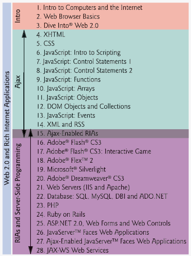

# O B J E C T I V E S

In this chapter you will learn:

■ Basic computing concepts.

■ The different types of programming languages.

■ The evolution of the Internet and the World Wide Web.

■ What Web 2.0 is and why it’s having such an impact among Internet-based and traditional businesses.

■ What Rich Internet Applications (RIAs) are and the key software technologies used to build RIAs.

**_The renaissance of interest in the web that we call Web 2.0 has reached the mainstream._ —Tim O’Reilly**

**_Billions of queries stream across the servers of these Internet services—the aggregate thoughtstream of humankind, online._ —John Battelle, _The Search_**

**_People are using the web to build things they have not built or written or drawn or communicated anywhere else._ —Tim Berners-Lee**

**_Some people take what we contribute and extend it and contribute it back \[to Ruby on Rails\]. That's really the basic open source success story._ —David Heinemeier Hansson, interviewed by Chris Karr at www.Chicagoist.com**

**1.1 Introduction  **
**1.2 What Is a Computer?  **
**1.3 Computer Organization  **
**1.4 Machine Languages, Assembly Languages and High-Level Languages  **
**1.5 History of the Internet and World Wide Web  **
**1.6 World Wide Web Consortium (W3C)  **
**1.7 Web 2.0 **
**1.8 Personal, Distributed and Client/Server Computing **
**1.9 Hardware Trends **
**1.10 Key Software Trend: Object Technology **
**1.11 JavaScript: Object-Based Scripting for the Web **
**1.12 Browser Portability **
**1.13 C, C++ and Java **
**1.14 BASIC, Visual Basic, Visual C++, C# and .NET **
**1.15 Software Technologies **
**1.16 Notes about Internet & World Wide Web How to Program, 4/e **
**1.17 Web Resources **
Summary | Terminology | Self-Review Exercises | Answers to Self-Review Exercises | Exercises

## Introduction

Welcome to Internet and World Wide Web programming and Web 2.0! And welcome to a walkthrough of the Web 2.0 phenomenon from the technical, business and social per- spectives. We’ve worked hard to create what we hope you’ll find to be an informative, en- tertaining and challenging learning experience. As you read this book, you may want to refer to www.deitel.com for updates and additional information.

The technologies you’ll learn in this book are fun for novices, and simultaneously are appropriate for experienced professionals who build substantial information systems. _Internet & World Wide Web How to Program, Fourth Edition_, is designed to be an effective learning tool for each of these audiences. How can one book appeal to both groups? The answer is that the core of this book emphasizes achieving program clarity through the proven techniques of structured programming, object-based programming and object-ori- ented programming. Beginners will learn programming the right way from the beginning. Experienced programmers will find “industrial-strength” code examples. We have attempted to write in a clear and straightforward manner using best practices.

Perhaps most important, the book presents hundreds of working examples and shows the outputs produced when these examples are rendered in browsers or run on computers. We present all concepts in the context of complete working programs. We call this the “live-code approach.” These examples are available for download from our website, www.deitel.com/books/iw3htp4/.

The early chapters introduce computer fundamentals, the Internet and the web. We show how to use software for browsing the web. We present a carefully paced introduction to “client-side” web programming, using the popular JavaScript language and the closely related technologies of XHTML (Extensible HyperText Markup Language), CSS (Cas-cading Style Sheets) and the DOM (Document Object Model). We often refer to “pro- gramming” as scripting—for reasons that will soon become clear. Novices will find that the material in the JavaScript chapters presents a solid foundation for the deeper treatment of scripting in the Adobe Flash, Adobe Flex, Microsoft Silverlight, PHP and Ruby on Rails chapters later in the book. Experienced programmers will read the early chapters quickly and find the treatment of scripting in the later chapters to be rigorous and challenging.

Most people are familiar with the exciting things that computers can do. Using this textbook, you’ll learn how to command computers to perform specific tasks. **Software** (i.e., the instructions you write to command the computer to perform **actions** and make **decisions**) controls computers (often referred to as **hardware**). JavaScript and PHP are among today’s most popular software development languages for web-based applications.

Computer use is increasing in almost every field of endeavor. In an era of steadily rising costs, computing costs have been decreasing dramatically because of rapid develop- ments in both hardware and software technologies. Computers that filled large rooms and cost millions of dollars just two decades ago can now be inscribed on the surfaces of silicon chips smaller than fingernails, costing perhaps a few dollars each. Silicon is one of the most abundant materials on earth—it is an ingredient in common sand. Silicon-chip tech- nology has made computing so economical that more than a billion general-purpose com- puters worldwide are now helping people in business, industry, government, education and in their personal lives. And billions more computers are embedded in cell phones, appliances, automobiles, security systems, game systems and so much more.

Through the early 1990s most students in introductory programming courses learned only the methodology called structured programming. As you study the various scripting languages in this book, you’ll learn both structured programming and the newer method- ology called object-based programming. After this, you’ll be well prepared to study today’s popular full-scale programming languages such as C++, Java, C# and Visual Basic .NET and to learn the even more powerful programming methodology of object-oriented pro- gramming. We believe that object-oriented programming will be the key programming methodology for at least several decades.

Today’s users are accustomed to applications with rich graphical user interfaces (GUIs), such as those used on Apple’s Mac OS X systems, Microsoft Windows systems, various Linux systems and more. Users want applications that employ the multimedia capabilities of graphics, images, animation, audio and video. They want applications that can run on the Internet and the web and communicate with other applications. Users want to apply database technologies for storing and manipulating their business and personal data. They want applications that are not limited to the desktop or even to some local computer network, but that can integrate Internet and web components, and remote data- bases. Programmers want to use all these capabilities in a truly portable manner so that applications will run without modification on a variety of **platforms** (i.e., different types of computers running different operating systems).

In this book, we present a number of powerful software technologies that will enable you to build these kinds of systems. Early in the book we concentrate on using technolo- gies such as the Extensible HyperText Markup Language (XHTML), JavaScript, CSS, Flash, Flex, Silverlight, Dreamweaver and Extensible Markup Language (XML) to build the portions of web-based applications that reside on the **client side** (i.e., the portions of applications that typically run in your web browsers such as Mozilla’s Firefox 2 or Microsoft’s Internet Explorer 7). Later in the book we concentrate on using technologies such as web servers, databases (integrated collections of data), PHP, Ruby on Rails, ASP.NET, ASP.NET Ajax and JavaServer Faces (JSF) to build the **server side** of web- based applications. These portions of applications typically run on “heavy-duty” computer systems on which organizations’ business-critical websites reside. By mastering the tech- nologies in this book, you’ll be able to build substantial web-based, client/server, database- intensive, “multitier” applications. We begin with a discussion of computer hardware and software fundamentals. If you are generally familiar with computers, the Internet and the web, you may want to skip some or all of this chapter.

To keep up to date with Internet and web programming developments, and the latest information on _Internet & World Wide Web How to Program, 4/e_, at Deitel & Associates, please register for our free e-mail newsletter, _the Deitel® Buzz Online,_ at

www.deitel.com/newsletter/subscribe.html

Please check out our growing list of Internet and web programming, and Internet business Resource Centers at

www.deitel.com/resourcecenters.html

Each week, we announce our latest Resource Centers in the newsletter. Figure 2 in the Preface includes a complete list of Deitel Resource Centers at the time of this writing. The Resource Centers include links to, and descriptions of, key tutorials, demos, free software tools, articles, e-books, white papers, videos, podcasts, blogs, RSS feeds and more that will help you deepen your knowledge of most of the subjects we discuss in this book.

Errata and updates for the book are posted at

www.deitel.com/books/iw3htp4/

You’re embarking on a challenging and rewarding path. As you proceed, if you have any questions, please send e-mail to

deitel@deitel.com

We’ll respond promptly. We hope that you’ll enjoy learning with _Internet & World Wide Web How to Program, Fourth Edition_.

**_Architecture of_ Internet & World Wide Web How to Program, 4/e** This book focuses on Web 2.0 and Rich Internet Application (RIA) development. Our goal is to develop webtop applications that have the responsiveness, look and feel of tradi- tional desktop applications. In the interim since the previous edition of this book, Deitel has evolved into a development organization, while maintaining its focus on programming languages textbook and professional book authoring, and corporate training. We’re build- ing the infrastructure for the Internet businesses we’re designing and developing as part of our Web 2.0 Internet Business Initiative. This edition has been enhanced with discussions of many practical issues we’ve encountered in developing that infrastructure.

Figure 1.1 shows the architecture of _Internet & World Wide Web How to Program, 4/e._ The book is divided into several parts. The first part, Chapters 1–3, provides an introduc- tion to the Internet and the web, web browsers and Web 2.0. These chapters provide a foundation for understanding Web 2.0 and Rich Internet Application development. Chapter 1 introduces hardware, software, communications and Web 2.0 topics. If you are 
a serious web developer, you’ll want to test your web applications across many browsers and platforms. The examples for this book target Microsoft’s Internet Explorer 7 (IE7) and Mozilla’s Firefox 2 (FF2) browsers, each of which is introduced in Chapter 2. The examples execute correctly in both browsers. Many of the examples will also work in other browsers such as Opera and Safari. Many of the examples will not work on earlier browsers. Microsoft Windows users should upgrade to IE7 and install FF2; readers with other operating systems should install Firefox 2. Web browsers—a crucial component of web applications—are free, as are most of the software technologies we present in this book. Chapter 3 discusses Web 2.0 from technical, business and social perspectives.

The second part of the book, Chapters 4–15, presents a 12-chapter treatment of Ajax component technologies that concludes with Chapter 15’s treatment of Ajax develop- ment. Ajax is not a new technology—we’ve been writing about all but one of its compo- nent technologies since the first edition of this book in 1999, and many of the technologies existed before that. However, Ajax is one of the key technologies of Web 2.0 and RIAs. Several later chapters in the book demonstrate technologies that encapsulate Ajax func- tionality to help make it operate across a wide variety of browsers and browser versions.

The third part of the book, Chapters 15–28, focuses on both the client and server sides of the GUI and graphical part of RIA development. Here we cover client-side tech- nologies such as Adobe Flash, Adobe Flex and Microsoft Silverlight that use, or can be combined with, Ajax or Ajax-like capabilities to develop RIAs. Each of these technologies also can consume web services. Next, we present the server side of web application devel- opment with discussions of web servers (IIS and Apache), databases, several server-side scripting languages such as PHP and Ruby on Rails, and several server-side frameworks such as ASP.NET 2.0 and JavaServer Faces. We complete our server-side discussion with a chapter on building web services.

You may have noticed that Chapter 15, Ajax-Enabled Rich Internet Applications, overlaps the second and third parts of the book. Chapter 15 serves as a bridge from “raw” Ajax development to sophisticated RIA development.

## What Is a Computer?

A **computer** is a device that can perform computations and make logical decisions billions of times faster than human beings can. For example, many of today’s personal computers can perform several billion additions per second. A person could operate a desk calculator for an entire lifetime and still not complete as many calculations as a powerful personal computer can perform in one second! (Points to ponder: How would you know whether the person added the numbers correctly? How would you know whether the computer added the numbers correctly?) Today’s fastest **supercomputers** can perform trillions of ad- ditions per second!

Computers process data under the control of sets of instructions called **computer pro- grams**_._ These programs guide the computer through orderly sets of actions specified by people called **computer programmers**_._

A computer consists of various devices referred to as hardware (e.g., the keyboard, screen, mouse, hard disk, memory, DVD drives and processing units)_._ The programs that run on a computer are referred to as software*.* Hardware costs have been declining dramat- ically in recent years, to the point that personal computers have become a commodity. In this book, you’ll learn proven methods that are reducing software development costs— object-oriented programming and object-oriented design.

## Computer Organization

Regardless of differences in physical appearance, virtually every computer may be envi- sioned as divided into six **logical units** or sections:

**1\. Input unit**. This is the “receiving” section of the computer. It obtains informa- tion (data and computer programs) from **input devices** and places this informa- tion at the disposal of the other units for processing. Most information is entered into computers through keyboards and mouse devices. Information also can be entered in many other ways, including by speaking to your computer, scanning images, uploading digital photos and videos, and receiving information from a network, such as the Internet.

**2\. Output unit**. This is the “shipping” section of the computer. It takes information that the computer has processed and places it on various **output devices** to make the information available for use outside the computer. Most information output from computers today is displayed on screens, printed on paper or used to control other devices. Computers also can output their information to networks, such as the Internet.

**3\. Memory unit**. This is the rapid-access, relatively low-capacity “warehouse” section of the computer. It stores computer programs while they are being executed. It re- tains information that has been entered through the input unit, so that it will be immediately available for processing when needed. The memory unit also retains processed information until it can be placed on output devices by the output unit. Information in the memory unit is typically lost when the computer’s power is turned off. The memory unit is often called either **memory** or **primary memory**_._

**4\. Arithmetic and logic unit (ALU)**. This is the “manufacturing” section of the computer. It is responsible for performing calculations, such as addition, subtrac- tion, multiplication and division. It contains the decision mechanisms that allow the computer, for example, to compare two items from the memory unit to de- termine whether they are equal, or if one is larger than the other.

**5\. Central processing unit (CPU)**. This is the computer’s “administrative” section. It coordinates and supervises the other sections’ operations. The CPU tells the in- put unit when information should be read into the memory unit, tells the ALU when information from the memory unit should be used in calculations and tells the output unit when to send information from the memory unit to certain output devices. Many of today’s computers have multiple CPUs and, hence, can perform many operations simultaneously—such computers are called **multiprocessors**.

**6\. Secondary storage unit**. This is the computer’s long-term, high-capacity “ware- housing” section. Programs or data not actively being used by the other units nor- mally are placed on secondary storage devices, such as your hard drive, until they are needed, possibly hours, days, months or even years later. Information in sec- ondary storage takes much longer to access than information in primary memory, but the cost per unit of secondary storage is much less than that of primary mem- ory. Other secondary storage devices include CDs and DVDs, which can hold hundreds of millions and billions of characters, respectively.

## Machine Languages, Assembly Languages and High-Level Languages

Programmers write instructions in various programming languages, some directly under- standable by computers and others requiring intermediate **translation** steps. Hundreds of computer languages are in use today. These may be divided into three general types:

**1\.** Machine languages

**2\.** Assembly languages

**3\.** High-level languages

Any computer can directly understand only its own **machine language**_._ Machine lan- guage is the “natural language” of a computer and as such is defined by its hardware design.[Note:Machine language is often referred to as object code**. This term predates “object- oriented programming.” These two uses of “object” are unrelated.] Machine languages generally consist of strings of numbers (ultimately reduced to 1s and 0s) that instruct com- puters to perform their most elementary operations one at a time. Machine languages are **machine dependent** (i.e., a particular machine language can be used on only one type of computer). Such languages are cumbersome for humans, as illustrated by the following

section of an early machine-language program that adds overtime pay to base pay and stores the result in gross pay:

+1300042774
+1400593419
+1200274027

Machine-language programming was simply too slow, tedious and error prone for most programmers. Instead of using the strings of numbers that computers could directly understand, programmers began using English-like abbreviations to represent elementary operations. These abbreviations formed the basis of **assembly languages**_._ **Translator pro- grams** called **assemblers** were developed to convert early assembly-language programs to machine language at computer speeds. The following section of an assembly-language pro- gram also adds overtime pay to base pay and stores the result in gross pay:

load basepay
add overpay
store grosspay

Although such code is clearer to humans, it is incomprehensible to computers until trans- lated to machine language.

Computer usage increased rapidly with the advent of assembly languages, but pro- grammers still had to use many instructions to accomplish even the simplest tasks. To speed the programming process, **high-level languages** were developed in which single statements could be written to accomplish substantial tasks. Translator programs called **compilers** convert high-level language programs into machine language*.* High-level lan- guages allow programmers to write instructions that look almost like everyday English and contain commonly used mathematical notations. A payroll program written in a high-level language might contain a statement such as

grossPay = basePay + overTimePay;

From your standpoint, obviously, high-level languages are preferable to machine and assembly language. C, C++, Microsoft’s .NET languages (e.g., Visual Basic, Visual C++ and Visual C#) and Java are among the most widely used high-level programming lan- guages. All of the Internet and web application development languages that you’ll learn in this book are high-level languages.

The process of compiling a high-level language program into machine language can take a considerable amount of computer time. **Interpreter** programs were developed to execute high-level language programs directly, although much more slowly. In this book, we study several key programming languages, including JavaScript, ActionScript, PHP and Ruby on Rails—each of these **scripting languages** is processed by interpreters. We also study markup languages such as XHTML and XML, which can be processed by inter- preted scripting languages. You’ll see that interpreters have played an especially important role in helping scripting languages and markup languages achieve their goal of portability across a variety of platforms.

**Performance Tip 1.1** _Interpreters have an advantage over compilers in scripting. An interpreted program can begin executing as soon as it is downloaded to the client’s machine, without the need to be compiled before it can execute. On the downside, scripts generally run much slower than compiled code._ 1.1

**Portability Tip 1.1** _Interpreted languages are more portable than compiled languages. Interpreters can be imple- mented for each platform on which the interpreted languages need to execute._ 1.1

**Software Engineering Observation 1.1** _Interpreted languages are more dynamic than compiled languages. For example, server-side applications can generate code in response to user interactions, and that code can then be interpreted in a browser._ 1.1

## History of the Internet and World Wide Web

In the late 1960s, one of the authors (HMD) was a graduate student at MIT. His research at MIT’s Project MAC (now the Laboratory for Computer Science—the home of the World Wide Web Consortium) was funded by ARPA—the Advanced Research Projects Agency of the Department of Defense. ARPA sponsored a conference at which several doz- en ARPA-funded graduate students were brought together at the University of Illinois at Urbana-Champaign to meet and share ideas. During this conference, ARPA rolled out the blueprints for networking the main computer systems of about a dozen ARPA-funded uni- versities and research institutions. They were to be connected with communications lines operating at a then-stunning 56 Kbps (i.e., 56,000 bits per second)—this at a time when most people (of the few who could) were connecting over telephone lines to computers at a rate of 110 bits per second. There was great excitement at the conference. Researchers at Harvard talked about communicating with the Univac 1108 “supercomputer” at the Uni- versity of Utah to handle calculations related to their computer graphics research. Many other intriguing possibilities were raised. Academic research about to take a giant leap for- ward. Shortly after this conference, ARPA proceeded to implement the **ARPANET**, which eventually evolved into today’s **Internet**.

Things worked out differently from what was originally planned. Rather than enabling researchers to share each other’s computers, it rapidly became clear that enabling researchers to communicate quickly and easily via what became known as **electronic mail** (**e-mail**, for short) was the key early benefit of the ARPANET. This is true even today on the Internet, as e-mail facilitates communications of all kinds among a billion people worldwide.

One of the primary goals for ARPANET was to allow multiple users to send and receive information simultaneously over the same communications paths (e.g., phone lines). The network operated with a technique called **packet switching**, in which digital data was sent in small bundles called **packets**. The packets contained address, error-control and sequencing information. The address information allowed packets to be routed to their destinations. The sequencing information helped in reassembling the packets— which, because of complex routing mechanisms, could actually arrive out of order—into their original order for presentation to the recipient. Packets from different senders were intermixed on the same lines. This packet-switching technique greatly reduced transmis- sion costs, as compared with the cost of dedicated communications lines.

The network was designed to operate without centralized control. If a portion of the network failed, the remaining working portions would still route packets from senders to receivers over alternative paths for reliability.

The protocol for communicating over the ARPANET became known as **TCP**—the **Transmission Control Protocol**. TCP ensured that messages were properly routed from sender to receiver and that they arrived intact.

As the Internet evolved, organizations worldwide were implementing their own net- works for both intraorganization (i.e., within the organization) and interorganization (i.e., between organizations) communications. A wide variety of networking hardware and soft- ware appeared. One challenge was to get these different networks to communicate. ARPA accomplished this with the development of **IP**—the **Internet Protocol**, truly creating a **“network of networks,”** the current architecture of the Internet. The combined set of pro- tocols is now commonly called **TCP/IP**.

Initially, Internet use was limited to universities and research institutions; then the military began using the Internet. Eventually, the government decided to allow access to the Internet for commercial purposes. Initially, there was resentment in the research and military communities—these groups were concerned that response times would become poor as “the Net” became saturated with users.

In fact, the exact opposite has occurred. Businesses rapidly realized that they could tune their operations and offer new and better services to their clients, so they started spending vast amounts of money to develop and enhance the Internet. This generated fierce competition among communications carriers and hardware and software suppliers to meet this demand. The result is that **bandwidth** (i.e., the information-carrying capacity) on the Internet has increased tremendously and costs have decreased significantly.

The **World Wide Web** allows computer users to locate and view multimedia-based documents on almost any subject over the Internet. Though the Internet was developed decades ago, the web is a relatively recent creation. In 1989, **Tim Berners-Lee** of CERN (the European Organization for Nuclear Research) began to develop a technology for sharing information via hyperlinked text documents. Berners-Lee called his invention the **HyperText Markup Language** (**HTML**). He also wrote communication protocols to form the backbone of his new information system, which he called the World Wide Web. In par- ticular, he wrote the **Hypertext Transfer Protocol** (**HTTP**)—a communications protocol used to send information over the web. Web use exploded with the availability in 1993 of the Mosaic browser, which featured a user-friendly graphical interface. Marc Andreessen, whose team at NCSA developed Mosaic, went on to found Netscape, the company that many people credit with initiating the explosive Internet economy of the late 1990s.

In the past, most computer applications ran on computers that were not connected to one another, whereas today’s applications can be written to communicate among the world’s computers. The Internet mixes computing and communications technologies. It makes our work easier. It makes information instantly and conveniently accessible world- wide. It enables individuals and small businesses to get worldwide exposure. It is changing the way business is done. People can search for the best prices on virtually any product or service. Special-interest communities can stay in touch with one another. Researchers can be made instantly aware of the latest breakthroughs. The Internet and the web are surely among humankind’s most profound creations.

## World Wide Web Consortium (W3C)

In October 1994, Tim Berners-Lee founded an organization—called the **World Wide Web Consortium** (**W3C**)—devoted to developing nonproprietary, interoperable technologies for the World Wide Web. One of the W3C’s primary goals is to make the web uni- versally accessible—regardless of ability, language or culture. The W3C home page (www.w3.org) provides extensive resources on Internet and web technologies.

The W3C is also a standardization organization. Web technologies standardized by the W3C are called **Recommendations**. W3C Recommendations include the Extensible HyperText Markup Language (XHTML), Cascading Style Sheets (CSS), HyperText Markup Language (HTML—now considered a “legacy” technology) and the Extensible Markup Language (XML). A recommendation is not an actual software product, but a document that specifies a technology’s role, syntax rules and so forth.

## Web 2.0

In 2003 there was a noticeable shift in how people and businesses were using the web and developing web-based applications. The term **Web 2.0** was coined by **Dale Dougherty** of **O’Reilly® Media**1 in 2003 to describe this trend. Although it became a major media buzzword, few people really know what Web 2.0 means. Generally, Web 2.0 companies use the web as a platform to create collaborative, community-based sites (e.g., social net- working sites, blogs, wikis, etc.).

**Web 1.0** (the state of the web through the 1990s and early 2000s) was focused on a relatively small number of companies and advertisers producing content for users to access (some people called it the “brochure web”). Web 2.0 _involves_ the user—not only is the content often created by the users, but users help organize it, share it, remix it, critique it, update it, etc. One way to look at Web 1.0 is as a _lecture_, a small number of professors informing a large audience of students. In comparison, Web 2.0 is a _conversation_, with everyone having the opportunity to speak and share views.

Web 2.0 is providing new opportunities and connecting people and content in unique ways. Web 2.0 embraces an **architecture of participation**—a design that encour- ages user interaction and community contributions. You, the user, are the most important aspect of Web 2.0—so important, in fact, that in 2006, _TIME Magazine_’s “Person of the Year” was “you.”2 The article recognized the social phenomenon of Web 2.0—the shift away from a powerful few to an empowered many. Several popular blogs now compete with traditional media powerhouses, and many Web 2.0 companies are built almost entirely on user-generated content. For websites like MySpace®, Facebook®, Flickr™, YouTube, eBay® and Wikipedia®, users create the content, while the companies provide the platforms. These companies _trust their users_—without such trust, users cannot make significant contributions to the sites.

The architecture of participation has influenced software development as well. Open source software is available for anyone to use and modify with few or no restrictions. Using **collective intelligence**—the concept that a large diverse group of people will create smart ideas—communities collaborate to develop software that many people believe is better and more robust than proprietary software. Rich Internet Applications (RIAs) are being devel-

1\. O’Reilly, T. “What is Web 2.0: Design Patterns and Business Models for the Next Generation of Software.” September 2005 <http://www.oreillynet.com/pub/a/oreilly/tim/news/2005/ 09/30/what-is-web-20.html?page=1>.

2\. Grossman, L. “TIME’s Person of the Year: You.” _TIME_, December 2006 <http:// www.time.com/time/magazine/article/0,9171,1569514,00.html>.

oped using technologies (such as Ajax) that have the look and feel of desktop software, enhancing a user’s overall experience. Software as a Service (SaaS)—software that runs on a server instead of a local computer—has also gained prominence because of sophisticated new technologies and increased broadband Internet access.

Search engines, including Google™, Yahoo!®, MSN®, Ask™, and many more, have become essential to sorting through the massive amount of content on the web. Social bookmarking sites such as del.icio.us and Ma.gnolia allow users to share their favorite sites with others. Social media sites such as Digg™, Spotplex™ and Netscape® enable the community to decide which news articles are the most significant. The way we find the information on these sites is also changing—people are **tagging** (i.e., labeling) web content by subject or keyword in a way that helps anyone locate information more effectively.

Web services have emerged and, in the process, have inspired the creation of many Web 2.0 businesses. Web services allow you to incorporate functionality from existing applications and websites into your own web applications quickly and easily. For example, using Amazon Web Services™, you can create a specialty bookstore and earn revenues through the Amazon Associates Program; or, using Google™ Maps web services with eBay web services, you can build location-based “mashup” applications to find auction items in certain geographical areas. Web services, inexpensive computers, abundant high- speed Internet access, open source software and many other elements have inspired new, exciting, **lightweight business models** that people can launch with only a small invest- ment. Some types of websites with rich and robust functionality that might have required hundreds of thousands or even millions of dollars to build in the 1990s can now be built for nominal amounts of money.

In the future, we’ll see computers learn to understand the meaning of the data on the web—the beginnings of the Semantic Web are already appearing. Continual improve- ments in hardware, software and communications technologies will enable exciting new types of applications.

These topics and more are covered in a detailed walkthrough in Chapter 3, Dive Into® Web 2.0. The chapter highlights the major characteristics and technologies of Web 2.0, providing examples of popular Web 2.0 companies and Web 2.0 Internet business and monetization models. You’ll learn about user-generated content, blogging, content networks, social networking, location-based services and more. In Chapters 4–28, you’ll learn key software technologies for building web-based applications in general, and Ajax- enabled, web-based Rich Internet Applications in particular. See our Web 2.0 Resource Center at www.deitel.com/web2.0/ for more information.

## Personal, Distributed and Client/Server Computing

In 1977, Apple Computer popularized **personal computing**_._ Computers became so eco- nomical that people could buy them for their own personal or business use. In 1981, IBM, the world’s largest computer vendor, introduced the IBM Personal Computer. This quick- ly legitimized personal computing in business, industry and government organizations, where IBM mainframes were heavily used.

These computers were for the most part “stand-alone” units—people transported disks back and forth between them to share information (this was often called “sneak- ernet”). Although early personal computers were not powerful enough to timeshare several users, these machines could be linked together in computer networks, sometimes over telephone lines and sometimes in **local area networks (LANs)** within an organization. This led to the phenomenon of **distributed computing**_,_ in which an organization’s computing, instead of being performed only at some central computer installation, is distributed over networks to the sites where the organization’s work is performed. Personal computers were powerful enough to handle the computing requirements of individual users as well as the basic communications tasks of passing information between computers electronically.

Today’s personal computers are as powerful as the million-dollar machines of just a few decades ago. The most powerful desktop machines—called **workstations**—provide individual users with enormous capabilities. Information is shared easily across computer networks, where computers called **servers** (file servers, database servers, web servers, etc.) offer data storage and other capabilities that may be used by **client** computers distributed throughout the network, hence the term **client/server computing**_._ Today’s popular oper- ating systems, such as UNIX, Linux, Mac OS X and Microsoft’s Windows-based systems, provide the kinds of capabilities discussed in this section.

## Hardware Trends

The Internet community thrives on the continuing stream of dramatic improvements in hardware, software and communications technologies. In general, people expect to pay at least a little more for most products and services every year. The opposite generally has been the case in the computer and communications industries, especially with regard to the hardware costs of supporting these technologies. For many decades, and with no change expected in the foreseeable future, hardware costs have fallen rapidly. This is a phe- nomenon of technology. **Moore’s Law** states that the power of hardware doubles every two years, while the price remains essentially the same.3 Significant improvements also have occurred in the communications field, especially in recent years, with the enormous demand for communications bandwidth attracting tremendous competition, forcing communications bandwidth to increase and prices to decline. We know of no other fields in which technology moves so quickly and costs fall so rapidly.

When computer use exploded in the 1960s and 1970s, there was talk of the huge improvements in human productivity that computing and communications would bring about. However, these productivity improvements did not immediately materialize. Orga- nizations were spending vast sums on computers and distributing them to their work- forces, but without immediate productivity gains. On the hardware side, it was the invention of microprocessor chip technology and its wide deployment in the late 1970s and 1980s which laid the groundwork for significant productivity improvements in the 1990s. On the software side, productivity improvements are now coming from object technology, which we use throughout this book.

Recently, hardware has been moving toward mobile, wireless technology. Small hand- held devices are now more powerful than early 1970s supercomputers. Portability is now a major focus for the computer industry. Wireless data-transfer speeds have become so fast that many Internet users’ primary web access is through wireless networks. The next few years will see dramatic advances in wireless capabilities for personal users and businesses.

3\. Moore, G. “Cramming More Components onto Integrated Circuits.” _Electronics_, April 1965 <ftp://download.intel.com/museum/Moores_Law/Articles-Press_Releases/Gordon_Moore\_ 1965_Article.pdf>.

## Key Software Trend: Object Technology

One of the authors, HMD, remembers the great frustration felt in the 1960s by software development organizations, especially those working on large-scale projects. During his undergraduate years, he had the privilege of working summers at a leading computer ven- dor on the teams developing timesharing, virtual-memory operating systems. This was a great experience for a college student. But, in the summer of 1967, reality set in when the company “decommitted” from producing as a commercial product the particular system on which hundreds of people had been working for many years. It was difficult to get this thing called software right—software is “complex stuff.”

Improvements to software technology did emerge, with the benefits of structured pro- gramming (and the related disciplines of **structured systems analysis and design**) being realized in the 1970s. Not until the technology of object-oriented programming became widely used in the 1990s, though, did software developers feel they had the necessary tools for making major strides in the software development process.

What are objects and why are they special? Actually, object technology is a packaging scheme that helps us create meaningful software units. These can be large and are highly focused on particular applications areas. There are date objects, time objects, paycheck objects, invoice objects, audio objects, video objects, file objects, record objects and so on. In fact, almost any noun can be reasonably represented as an object.

We live in a world of objects. Just look around you. There are cars, planes, people, animals, buildings, traffic lights, elevators and the like. Before object-oriented languages appeared, procedural programming languages (such as Fortran, COBOL, Pascal, BASIC and C) were focused on actions (verbs) rather than on things or objects (nouns). Program- mers living in a world of objects programmed primarily using verbs. This made it awkward to write programs. Now, with the availability of popular object-oriented languages, such as C++, Java, Visual Basic and C#, programmers continue to live in an object-oriented world _and_ can program in an object-oriented manner. This is a more natural process than procedural programming and has resulted in significant productivity gains.

A key problem with procedural programming is that the program units do not effec- tively mirror real-world entities, so these units are not particularly reusable. It’s not unusual for programmers to “start fresh” on each new project and have to write similar software “from scratch.” This wastes time and money, as people repeatedly “reinvent the wheel.” With object technology, the software entities created (called **classes**), if properly designed, tend to be reusable on future projects. Using libraries of reusable componentry can greatly reduce effort required to implement certain kinds of systems (compared to the effort that would be required to reinvent these capabilities on new projects).

**Software Engineering Observation 1.2** _Extensive class libraries of reusable software components are available on the Internet. Many of these libraries are free._ 1.2

**Software Engineering Observation 1.3** _Some organizations report that the key benefit object-oriented programming gives them is not software that is reusable but, rather, software that is more understandable, better organized and easier to maintain, modify and debug. This can be significant, because perhaps as much as 80 percent of software cost is associated not with the original efforts to develop the software, but with the continued evolution and maintenance of that software throughout its lifetime._ 1.3

## JavaScript: Object-Based Scripting for the Web

JavaScript is an object-based scripting language with strong support for proper software engineering techniques. Students learn to create and manipulate objects from the start in JavaScript. JavaScript is available free in today’s popular web browsers.

Does JavaScript provide the solid foundation of programming principles typically taught in first programming courses—a portion of the intended audience for this book? We think so.

The JavaScript chapters of the book are more than just an introduction to the lan- guage. They also present an introduction to computer programming fundamentals, including control structures, functions, arrays, recursion, strings and objects. Experienced programmers will read Chapters 6–13 quickly and master JavaScript by reading our live- code examples and by examining the corresponding screenshots. Beginners will learn com- puter programming in these carefully paced chapters by reading the code explanations and completing the many exercises.

JavaScript is a powerful scripting language. Experienced programmers sometimes take pride in creating strange, contorted, convoluted JavaScript code. This kind of coding makes programs more difficult to read, test and debug. This book is also geared for novice programmers; for all readers we stress program clarity.

**Good Programming Practice 1.1** _Write your programs in a simple and straightforward manner. This is sometimes referred to as KIS (“keep it simple”). One key aspect of keeping it simple is another interpretation of KIS— “keep it small.” Do not “stretch” the language by trying bizarre uses._ 1.1

You’ll see that JavaScript is a portable scripting language and that programs written in JavaScript can run in many web browsers. Actually, portability is an elusive goal. \\

**Portability Tip 1.2** _Although it is easier to write portable programs in JavaScript than in many other programming languages, differences among interpreters and browsers make portability difficult to achieve. Simply writing programs in JavaScript does not guarantee portability. Programmers occasionally need to research platform variations and write their code accordingly._ 1.2

**Portability Tip 1.3** _When writing JavaScript programs, you need to deal directly with cross-browser portability is- sues. Such issues are hidden by JavaScript libraries (e.g., Dojo, Prototype, Script.aculo.us and ASP.NET Ajax) which provide powerful, ready-to-use capabilities that simplify JavaScript cod- ing by making it cross-browser compatible._ 1.3

**Error-Prevention Tip 1.1** _Always test your JavaScript programs on all systems and in all web browsers for which they are intended._ 1.1

**Good Programming Practice 1.2** _Read the documentation for the JavaScript version you are using to access JavaScript’s rich col- lection of features._ 1.2

**Error-Prevention Tip 1.2** _Your computer and JavaScript interpreter are good teachers. If you are not sure how a feature works, even after studying the documentation, experiment and see what happens. Study each er- ror or warning message and adjust the code accordingly._ 1.2

JavaScript was created by Netscape, the company that created the first widely suc- cessful web browser. Both Netscape and Microsoft have been instrumental in the stan- dardization of JavaScript by ECMA International (formerly the European Computer Manufacturers Association) as ECMAScript. In Chapters 16–17, we discuss Adobe Flash, which uses another scripting language named ActionScript. ActionScript and JavaScript are converging in the next version of the JavaScript standard (JavaScript 2/ECMA Script version 4) currently under development by ECMA. This will result in a universal client scripting language, greatly simplifying web application development.

## Browser Portability

Ensuring a consistent look and feel on client-side browsers is one of the great challenges of developing web-based applications. Currently, a standard does not exist to which soft- ware developers must adhere when creating web browsers. Although browsers share a com- mon set of features, each browser might render pages differently. Browsers are available in many versions and on many different platforms (Microsoft Windows, Apple Macintosh, Linux, UNIX, etc.). Vendors add features to each new version that sometimes result in cross-platform incompatibility issues. Clearly it is difficult to develop web pages that ren- der correctly on all versions of each browser. In this book we develop web applications that execute on both the Internet Explorer 7 and Firefox 2 browsers.

**Portability Tip 1.4** _The web is populated with many different browsers, which makes it difficult for authors and web application developers to create universal solutions. The W3C is working toward the goal of a universal client-side platform._ 1.4

## C, C++ and Java

**_C_**
The **C** language was developed by Dennis Ritchie at Bell Laboratories. C was implement- ed in 1972. C initially became known as the development language of the UNIX operating system. Today, virtually all new major operating systems are written in C and/or C++.

**_C++_** Bjarne Stroustrup developed **C++**, an extension of C, in the early 1980s. C++ provides a number of features that “spruce up” the C language, but more importantly, it provides ca- pabilities for object-oriented programming. C++ is a hybrid language: It is possible to pro- gram in either a C-like style (procedural programming), in which the focus is on actions, or an object-oriented style, in which the focus is on objects, or both. C and C++ have in- fluenced many subsequent programming languages, such as Java, C#, JavaScript and PHP, each of which has a syntax similar to C and C++.

**_Java_**
Microprocessors are having a profound impact in intelligent consumer electronic devices. Recognizing this, Sun Microsystems in 1991 funded an internal corporate research project code-named Green to provide software for these devices. The project resulted in the de- velopment of a C++-based language that its creator, James Gosling, called Oak after an oak tree outside his window at Sun. It was later discovered that there already was a computer language called Oak. When a group of Sun people visited a local coffee shop, the name **Java** was suggested and it stuck.

The Green project ran into some difficulties. The marketplace for intelligent con- sumer electronic devices did not develop in the early 1990s as quickly as Sun had antici- pated. The project was in danger of being canceled. By sheer good fortune, the World Wide Web exploded in popularity in 1993, and Sun saw the immediate potential of using Java to add **dynamic content** (e.g., interactivity, animations and the like) to web pages. This breathed new life into the project.

Sun formally announced Java at an industry conference in May 1995. Java garnered the attention of the business community because of the phenomenal interest in the web. Java is now used to develop large-scale enterprise applications, to enhance the function- ality of web servers (the computers that provide the content we see in our web browsers), to provide applications for consumer devices (e.g., cell phones, pagers and personal digital assistants) and for many other purposes.

## BASIC, Visual Basic, Visual C++, C# and .NET

The **BASIC** (Beginner’s All-purpose Symbolic Instruction Code) programming language was developed in the mid-1960s at Dartmouth College as a means of writing simple pro- grams. BASIC’s primary purpose was to familiarize novices with programming techniques. Microsoft’s Visual Basic language, introduced in the early 1990s to simplify the develop- ment of Microsoft Windows applications, has become one of the most popular program- ming languages in the world.

Microsoft’s latest development tools are part of its corporatewide strategy for inte- grating the Internet and the web into computer applications. This strategy is implemented in Microsoft’s **.NET platform**, which provides the capabilities developers need to create computer applications that can execute on computers distributed across the Internet. Microsoft’s three primary programming languages are **Visual Basic** (based on the original BASIC), **Visual C++** (based on C++) and **Visual C#** (a relatively new language based on C++ and Java that was developed expressly for the .NET platform). Developers using .NET can write software components in the language they are most familiar with, then form applications by combining those components with others written in any .NET language.

## Software Technologies

In this section, we discuss some software engineering topics and buzzwords that you’ll hear in the software development community. We’ve created Resource Centers on most of these topics, with many more on the way.

**Agile Software Development** is a set of methodologies that try to get software imple- mented quickly with fewer resources than previous methodologies. Check out the Agile Alliance (www.agilealliance.org) and the Agile Manifesto (www.agilemanifesto.org).

**Refactoring** involves reworking code to make it clearer and easier to maintain while preserving its functionality. It’s widely employed with agile development methodologies. Many refactoring tools are available to do major portions of the reworking automatically.

**Design patterns** are proven architectures for constructing flexible and maintainable object-oriented software. The field of design patterns tries to enumerate those recurring patterns, encouraging software designers to reuse them to develop better-quality software with less time, money and effort.

**Game programming**. The computer game business is larger than the first-run movie business. College courses and even majors are now devoted to the sophisticated software techniques used in game programming. Chapter 17 discusses building interactive games with Adobe Flash CS3. Also check out our Resource Centers on Game Programming, C++ Game Programming and Programming Projects.

**Open source software** is developed in a way unlike the proprietary development that dominated software’s early years and remains strong today. With open source develop- ment, individuals and companies contribute their efforts in developing, maintaining and evolving software in exchange for the right to use that software for their own purposes, typ- ically at no charge. Open source code generally gets scrutinized by a much larger audience than proprietary software, so bugs may be removed faster. Open source also encourages more innovation. Sun recently open sourced Java. Some organizations you’ll hear a lot about in the open source community are the Eclipse Foundation (the Eclipse IDE is pop- ular for C++ and Java software development), the Mozilla Foundation (the creators of the Firefox browser), the Apache Software Foundation (the creators of the Apache web server) and SourceForge (which provides the tools for managing open source projects and cur- rently has over 150,000 open source projects under development).

**Linux** is an open source operating system and one of the greatest successes of the open source movement. Apache is the most popular open source web server. **MySQL** (see Chap- ters 22–24) is an open source database management system. **PHP** (see Chapter 23) is the most popular open source server-side “scripting” language for developing Internet-based applications. **LAMP** is an acronym for the set of open source technologies that many developers used to build web applications—it stands for Linux, Apache, MySQL and PHP (or Perl or Python—two other scripting languages used for similar purposes).

**Ruby on Rails** (see Chapter 24) combines the scripting language Ruby with the Rails web application framework developed by the company 37Signals. Their book, _Getting Real_, is a must read for today’s web application developers; read it free at getting-

real.37signals.com/toc.php. Many Ruby on Rails developers have reported significant productivity gains over using other languages when developing database-intensive web applications.

Software has generally been viewed as a product; most software still is offered this way. If you want to run an application, you buy a software package from a software vendor. You then install that software on your computer and run it as needed. As new versions of the software appear, you upgrade your software, often at significant expense. This process can become cumbersome for organizations with tens of thousands of systems that must be maintained on a diverse array of computer equipment. With **Software as a Service (SaaS)**, the software runs on servers elsewhere on the Internet. When those servers are updated, all clients worldwide see the new capabilities; no local installation is needed. You access the service through a browser—these are quite portable, so you can run the same applications on different kinds of computers from anywhere in the world. Salesforce.com, Google, Microsoft and 37Signals all offer SaaS.

## Notes about _Internet & World Wide Web How to Program, 4/e_

In 1995, we saw an explosion of interest in the Internet and the World Wide Web. We immersed ourselves in these technologies, and a clear picture started to emerge in our minds of the next direction to take in writing textbooks for introductory programming courses. **Electronic commerce**, or **e-commerce**, as it is typically called, began to dominate the business, financial and computer industry news. This was a reconceptualization of the way business should be conducted. We still wanted to teach programming principles, but we felt compelled to do it in the context of the technologies that businesses and organiza- tions need to create Internet-based and web-based applications. With this realization, the first edition of _Internet & World Wide Web How to Program_ was born and published in December of 1999.

_Internet & World Wide Web How to Program, Fourth Edition_ teaches programming languages and programming language principles. In addition, we focus on the broad range of technologies that will help you build real-world Internet-based and web-based applica- tions that interact with other applications and with databases. These capabilities allow you to develop the kinds of enterprise-level, distributed applications popular in industry today.

You’ll learn computer programming and basic principles of computer science and information technology. You also will learn proven software development methods—top- down stepwise-refinement, functionalization and object-based programming. Our pri- mary programming language is JavaScript, a compact language that is especially designed for developing Internet- and web-based applications. Chapters 6–13 present a rich discus- sion of JavaScript and its capabilities, including dozens of complete examples followed by screen images that illustrate typical program inputs and outputs.

After you learn programming principles from the detailed JavaScript discussions, we present condensed treatments of four other popular Internet/web programming languages for building the server side of Internet- and web-based client/server applications. Chapter 23 introduces the popular PHP scripting language. Chapter 24 introduces Ruby, the scripting language used with the Ruby on Rails framework for rapid development of database-driven web applications. In Chapter 25, we discuss ASP.NET 2.0—Microsoft’s technology for server-side scripting. ASP.NET pages can be written in Visual Basic and C#; we code ASP.NET pages using Visual Basic. In Chapters 26–27, we discuss JavaServer Faces, which uses the Java programming language. Finally, in Chapter 28, we discuss web services (using examples in both Java and ASP.NET).

## Web Resources

www.deitel.com/

Check this site frequently for updates, corrections and additional resources for all Deitel & Associ- ates, Inc., publications. www.deitel.com/resourcecenters.html

Check out the complete list of Deitel Resource Centers, including numerous programming, open source, Web 2.0 and Internet business topics.

netforbeginners.about.com

The About.com _Internet for Beginners_ guide provides valuable resources for further exploration of the history and workings of the Internet and the web. www.learnthenet.com/english/index.html

_Learn the Net_ is a website containing a complete overview of the Internet, the web and the underly- ing technologies. The site contains much information appropriate for novices. www.w3.org

The World Wide Web Consortium (W3C) website offers a comprehensive description of web tech- nologies. For each Internet technology with which the W3C is involved, the site provides a descrip- tion of the technology, its benefits to web designers, the history of the technology and the future goals of the W3C in developing the technology.

**Summary**

**_Section 1.1 Introduction_**

- In an era of steadily rising costs, computing costs have been decreasing dramatically because of rapid developments in both hardware and software technologies.

- Technologies such as Extensible HyperText Markup Language (XHTML), JavaScript, Flash, Flex, Dreamweaver and Extensible Markup Language (XML) are used to build the portions of web-based applications that reside on the client side (i.e., the portions of applications that typi- cally run on web browsers such as Firefox or Microsoft’s Internet Explorer).

- Technologies such as web servers, databases, ASP.NET, PHP, Ruby on Rails and JavaServer Fac- es are used to build the server side of web-based applications. These parts of applications typically run on “heavy-duty” computer systems on which organizations’ business-critical websites reside.

**_Section 1.2 What Is a Computer?_**

- A computer is a device capable of performing computations and making logical decisions at speeds billions of times faster than human beings can.

- A computer processes data under the control of sets of instructions called computer programs, which guide it through orderly sets of actions specified by computer programmers.

- The various devices that comprise a computer system are referred to as hardware.

- The computer programs that run on a computer are referred to as software.

**_Section 1.3 Computer Organization_**

- The input unit is the “receiving” section of the computer. It obtains information from input devices and places it at the disposal of the other units for processing.

- The output unit is the “shipping” section of the computer. It takes information processed by the computer and places it on output devices to make it available for use outside the computer.

- The memory unit is the rapid-access, relatively low-capacity “warehouse” section of the comput- er. It retains information that has been entered through the input unit, making it immediately available for processing when needed, and retains information that has already been processed until it can be placed on output devices by the output unit.

- The arithmetic and logic unit (ALU) is the “manufacturing” section of the computer. It is re- sponsible for performing calculations and making decisions.

- The central processing unit (CPU) is the “administrative” section of the computer. It coordinates and supervises the operation of the other sections.

- The secondary storage unit is the long-term, high-capacity “warehousing” section of the comput- er. Programs or data not being used by the other units are normally placed on secondary storage devices (e.g., disks) until they are needed, possibly hours, days, months or even years later.

**_Section 1.4 Machine Languages, Assembly Languages and High-Level Languages_**

- Any computer can directly understand only its own machine language, which generally consists of strings of numbers ultimately reduced to 1s and 0s that instruct the computer to perform its most elementary operations.

- English-like abbreviations form the basis of assembly languages. Translator programs called as- semblers convert assembly-language programs to machine language.

- Compilers translate high-level language programs into machine-language programs. High-level languages contain English words and conventional mathematical notations.

- Interpreter programs directly execute high-level language programs, eliminating the need to compile them into machine language.

**_Section 1.5 History of the Internet and World Wide Web_**

- In the late 1960s, ARPA, the Advanced Research Projects Agency of the U.S. Department of Defense rolled out the blueprints for networking the main computer systems of about a dozen ARPA-funded universities and research institutions. ARPA then proceeded to implement the ARPANET, the predecessor to today’s Internet.

- The World Wide Web allows computer users to locate and view multimedia-based documents (i.e., documents with text, graphics, animations, audios or videos) on almost any subject.

- In 1989, Tim Berners-Lee of CERN began to develop the World Wide Web and several com- munication protocols that form the backbone of the web.

- Web use exploded with the availability in 1993 of the Mosaic browser, which featured a user- friendly graphical interface. Marc Andreessen, whose team at NCSA developed Mosaic, went on to found Netscape, the company that many people credit with initiating the explosive Internet economy of the late 1990s.

**_Section 1.6 World Wide Web Consortium (W3C)_**

- In October 1994, Tim Berners-Lee founded the World Wide Web Consortium (W3C)—an organization devoted to developing nonproprietary, interoperable technologies for the web.

**_Section 1.7 Web 2.0_**

- Web 2.0 companies use the web as a platform to create collaborative, community-based sites (e.g., social networking sites, blogs, wikis, etc.).

- Web 1.0 (the state of the web through the 1990s and early 2000s) was focused on a relatively small number of companies and advertisers producing content for users to access.

- Web 2.0 embraces an architecture of participation—a design that encourages user interaction and community contributions.

- Using the collective intelligence—the concept that a large diverse group of people will create smart ideas—communities collaborate to develop open source software that many people believe is better and more robust than proprietary software.

- Rich Internet Applications (RIAs) are being developed using technologies (such as Ajax) that have the look and feel of desktop software, enhancing a user’s overall experience.

- Web services, inexpensive computers, abundant high-speed Internet access, open source software and many other elements have inspired new, exciting, lightweight business models that people can launch with only a small investment.

**_Section 1.8 Personal, Distributed and Client/Server Computing_**

- Apple Computer popularized personal computing.

- IBM’s Personal Computer quickly legitimized personal computing in business, industry and government organizations, where IBM mainframes were heavily used.

- Although early personal computers were not powerful enough to timeshare several users, these machines could be linked together in computer networks, sometimes over telephone lines and sometimes in local area networks (LANs) within an organization. This led to the phenomenon of distributed computing.

- Today’s personal computers are as powerful as the million-dollar machines of just a few decades ago, and information is shared easily across computer networks.

**_Section 1.9 Hardware Trends_**

- Moore’s Law states that the power of hardware doubles every two years, while the price remainsessentially the same.

**_Section 1.10 Key Software Trend: Object Technology_**

- Objects are essentially reusable software components that model real-world items.

- Not until object-oriented programming became widely used in the 1990s did software develop- ers feel they had the tools to make major strides in the software development process.

- Object technology is a packaging scheme that helps us create meaningful software units.

- A key problem with procedural programming is that the program units do not effectively mirror real-world entities, so these units are not particularly reusable.

- With object technology, the software entities created (called classes), if properly designed, tend to be reusable on future projects. Using libraries of reusable componentry can greatly reduce ef- fort required to implement certain kinds of systems.

- Some organizations report that the key benefit object-oriented programming gives them is the production of software which is more understandable, better organized and easier to maintain, modify and debug.

**_Section 1.11 JavaScript: Object-Based Scripting for the Web_**

- JavaScript is an object-based scripting language with strong support for proper software engineering techniques.

- JavaScript was created by Netscape. Both Netscape and Microsoft have been instrumental in the standardization of JavaScript by ECMA International as ECMAScript.

**_Section 1.12 Browser Portability_**

- Ensuring a consistent look and feel on client-side browsers is one of the great challenges of developing web-based applications.

**_Section 1.13 C, C++ and Java_**

- C initially became known as the development language of the UNIX operating system. Today,virtually all new major operating systems are written in C and/or C++.

- C++ provides a number of features that “spruce up” the C language, but more importantly, it provides capabilities for object-oriented programming.

- Java is used to create dynamic and interactive content for web pages, develop enterprise applica- tions, enhance web-server functionality, provide applications for consumer devices and more.

**_Section 1.14 BASIC, Visual Basic, Visual C++, C# and .NET_**

- The BASIC programming language was developed in the mid-1960s at Dartmouth College. Its primary purpose was to familiarize novices with programming techniques.

- Microsoft’s Visual Basic was introduced in the early 1990s to simplify the process of developing Microsoft Windows applications.

- Microsoft has a corporatewide strategy for integrating the Internet and the web into computer applications. This strategy is implemented in Microsoft’s .NET platform.

- The .NET platform’s three primary programming languages are Visual Basic, Visual C++ and Visual C#.

- .NET developers can write software components in their preferred language, then form applica- tions by combining those components with components written in any .NET language.

**_Section 1.15 Software Technologies_**

- Agile Software Development is a set of methodologies that try to get software implemented quickly with fewer resources than previous methodologies.

- Refactoring involves reworking code to make it clearer and easier to maintain while preserving its functionality.

- Design patterns are proven architectures for constructing flexible and maintainable object-ori- ented software.

- Open source development allows individuals and companies to contribute their efforts in devel- oping, maintaining and evolving software in exchange for the right to use that software for their own purposes, typically at no charge.

- With Software as a Service (SaaS), the software runs on servers elsewhere on the Internet, rather than on the desktop.

**Terminology** actions Agile Software Development architecture of participation arithmetic and logic unit (ALU) ARPANET assemblers assembly language bandwidth BASIC C C++ central processing unit (CPU) class client side client/server computing collective intelligence compilers computer computer program computer programmer CSS

Dale Dougherty data data structure decision design pattern distributed computing DOM (Document Object Model) dynamic content electronic commerce (e-commerce) electronic mail (e-mail) function game programming hardware high-level languages HTML (HyperText Markup Language) HTTP (Hypertext Transfer Protocol) input device input unit Internet interpreter IP (Internet Protocol)

Java JavaScript LAMP library lightweight business models Linux local area networks (LANs) logical unit machine dependent machine language memory memory unit method Moore’s Law multiprocessor MySQL .NET platform O’Reilly Media object code object-based programming object-oriented programming open source software output devices output unit packet packet switching personal computer PHP platform

primary memory refactoring Ruby on Rails scripting scripting language secondary storage unit server side server software Software as a Service (SaaS) structured programming structured systems analysis and design supercomputer tagging TCP (Transmission Control Protocol) TCP/IP translation translator program Visual Basic Visual C# Visual C++ Web 1.0 Web 2.0 workstation World Wide Web World Wide Web Consortium (W3C) XHTML (Extensible HyperText Markup Lan-

guage) XML (Extensible Markup Language)

**Self-Review Exercises 1.1**
Fill in the blanks in each of the following:

a) The company that popularized personal computing was . b) The computer that made personal computing legitimate in business and industry was\_\_\_\_
the . c) Computers process data under the control of sets of instructions called computer

. d) The six key logical units of the computer are the , , ,

, and the . e) The three classes of languages discussed in the chapter are , , and

. f) The programs that translate high-level language programs into machine language are

called . g) , or labeling content, is another key part of the collaborative theme of Web 2.0. h) With Internet applications, the desktop evolves to the . i) involves reworking code to make it clearer and easier to maintain while pre-

serving its functionality. j) With development, individuals and companies contribute their efforts in de-

veloping, maintaining and evolving software in exchange for the right to use that soft- ware for their own purposes, typically at no charge.

k) The was the predecessor to the Internet. l) The information-carrying capacity of a communications medium like the Internet is

called . m) The acronym TCP/IP stands for .

**1.2** Fill in the blanks in each of the following statements. a) The allows computer users to locate and view multimedia-based documents

on almost any subject over the Internet. b) founded an organization—called the World Wide Web Consortium

(W3C)—devoted to developing nonproprietary, interoperable technologies for the World Wide Web.

c) are reusable software components that model items in the real world. d) In a typical client/server relationship, the requests that some action be per-

formed and the performs the action and responds.

**Answers to Self-Review Exercises 1.1**
a) Apple. b) IBM Personal Computer. c) programs. d) input unit, output unit, memory unit, arithmetic and logic unit, central processing unit, secondary storage unit. e) machine languag- es, assembly languages and high-level languages. f) compilers. g) Tagging. h) webtop. i) Refactor- ing. j) open source. k) ARPANET. l) bandwidth. m) Transmission Control Protocol/Internet Protocol.

**1.2**
a) World Wide Web. b) Tim Berners-Lee. c) Objects. d) client, server.

**Exercises 1.3**
Categorize each of the following items as either hardware or software:

a) CPU b) ALU c) input unit d) an editor program

**1.4**
Fill in the blanks in each of the following statements: a) Which logical unit of the computer receives information from outside the computer for

use by the computer? . b) The process of instructing the computer to solve specific problems is called . c) What type of computer language uses English-like abbreviations for machine-language

instructions? . d) Which logical unit of the computer sends information that has already been processed

by the computer to various devices so that the information may be used outside the computer? .

e) Which logical units of the computer retain information? . f) Which logical unit of the computer performs calculations? . g) Which logical unit of the computer makes logical decisions? . h) The level of computer language most convenient for you to write programs quickly and

easily is . i) The only language that a computer directly understands is called that computer's

. j) Which logical unit of the computer coordinates the activities of all the other logical

units? .

k) Some organizations report that the key benefit gives them is the production of software which is more understandable, better organized and easier to maintain, modify and debug.

l) Web 2.0 embraces an —a design that encourages user interaction and com- munity contributions.

m) is the concept that a large diverse group of people will create smart ideas.

**1.5**
Fill in the blanks in each of the following statements (based on Section 1.15, Software Technologies):

a) The open source database management system used in LAMP development is .

b) A key advantage of Software as a Service (SaaS) is . c) are proven architectures for constructing flexible and maintainable object-ori-

ented software. d) is the most popular open source server-side “scripting” language for develop-

ing Internet-based applications.

**1.6**
What is the relationship between JavaScript and ECMAScript?

**1.7**
In this chapter, we discussed a few popular Web 2.0 businesses including MySpace, Flickr, YouTube and Wikipedia. Indentify a Web 2.0 business and describe why it fits the Web 2.0 busi- ness model.
