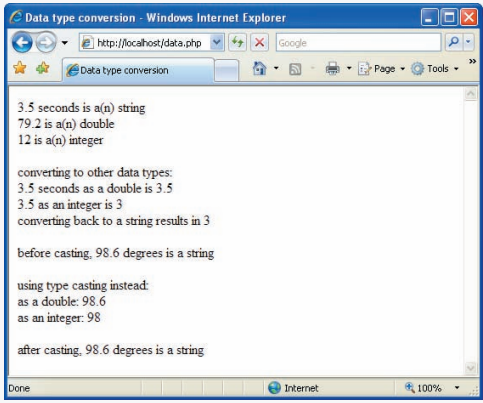
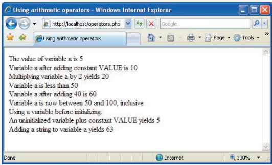
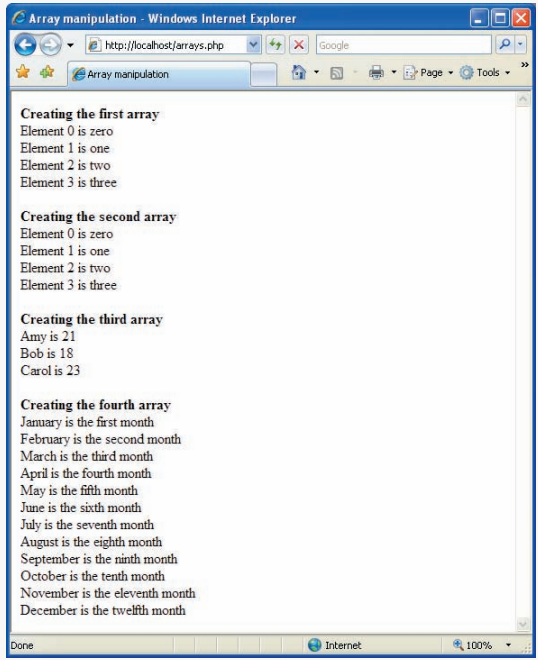
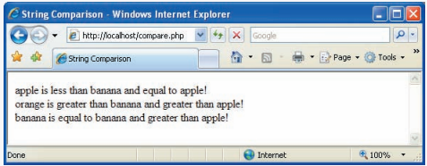
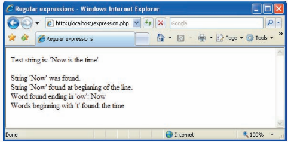
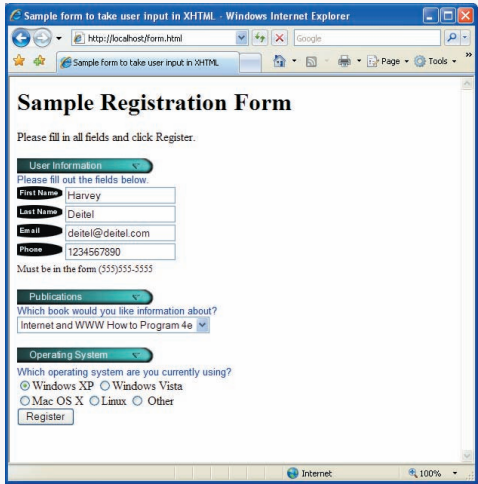

**OBJECTIVES**

In this chapter you will learn:

- To manipulate data of various types.

- To use operators, arrays and control statements.

- To use regular expressions to search for patterns.

- To construct programs that process form data.

- To store data on the client using cookies.

- To create programs that interact with MySQL databases.

## Introduction

**PHP**, or **PHP: Hypertext Preprocessor**, has become one of the most popular server-side scripting languages for creating dynamic web pages. PHP was created by Rasmus Lerdorf to track users at his website. In 1995, Lerdorf released it as a package called the “Personal Home Page Tools.” Two years later, PHP 2 featured built-in database support and form handling. In 1997, PHP 3 was released with a rewritten parser, which substantially in- creased performance and led to an explosion of PHP use. The release of PHP 4 featured the new _Zend Engine_ from Zend, a PHP software company. This version was considerably faster and more powerful than its predecessor, further increasing PHP’s popularity. It is estimated that over 15 million domains now use PHP, accounting for more than 20 per- cent of web pages.1 Currently, PHP 5 features the _Zend Engine 2_, which provides further speed increases, exception handling and a new object-oriented programming model^2^. More information about the Zend Engine can be found at www.zend.com.

PHP is an open-source technology that is supported by a large community of users and developers. PHP is platform independent—implementations exist for all major UNIX, Linux, Mac and Windows operating systems. PHP also supports many databases, including MySQL.

After introducing the basics of the PHP scripting language, we discuss form pro- cessing and business logic, which are vital to e-commerce applications. Next, we build a three-tier web application that queries a MySQL database. We also show how PHP can use cookies to store information on the client that can be retrieved during future visits to the website. Finally, we revisit the form-processing example to demonstrate some of PHP’s more dynamic capabilities.

## PHP Basics

The power of the web resides not only in serving content to users, but also in responding to requests from users and generating web pages with dynamic content. Interactivity be- tween the user and the server has become a crucial part of web functionality, making PHP—a language written specifically for interacting with the web—a valuable tool.

**_Installing PHP_**

PHP code is embedded directly into XHTML documents, though these script segments are interpreted by the server before being delivered to the client. This allows the document author to write XHTML in a clear, concise manner. PHP script file names end with .php.

To run a PHP script, PHP must first be installed on your system. All examples and exercises in this chapter have been verified using PHP 5.2.3, the most current release at the time of publication. The most recent version of PHP can be downloaded from www.php.net/downloads.php, and installation instructions are available at www.php.net/ manual/en/installation.php. Be sure to check for specific instructions that pertain to the server you want to use. During setup, when the **Choose Items to Install** window is dis- played, expand the **Extensions** menu by clicking the small plus sign to its left. Then click the down arrow to the left of the MySQL option, and select the **Will be installed on local hard drive** option. This will ensure that your PHP script will be able to access your MySQL database server for examples later in this chapter.

Although PHP can be used from the command line, a web server is necessary to take full advantage of the scripting language. Before continuing, files from the Chapter 23 examples directory to the web server’s root directory (e.g., C:\\Inetpub\\wwwroot for IIS or C:\\Program Files\\Apache Software Foundation\\Apache2\\htdocs for Apache on Win- dows or /var/www/html or similar on Linux).

**_Simple PHP Program_**

Figure 23.1 presents a simple PHP program that displays a welcome message. In PHP, code is inserted between the scripting delimiters **<?php** and **?>**. PHP code can be placed anywhere in XHTML markup, as long as the code is enclosed in these delimiters. Line 1 uses function print to output the XML declaration. This avoids the <? in the XML dec-
```php
<?php print( '<?xml version = "1.0" encoding = "utf-8"?>' ) ?>
 <!DOCTYPE html PUBLIC "-//W3C//DTD XHTML 1.0 Strict//EN"
 "http://www.w3.org/TR/xhtml1/DTD/xhtml1-strict.dtd">

 <!-- Fig. 23.1: first.php -->
 <!-- Simple PHP program. -->
 <html xmlns = "http://www.w3.org/1999/xhtml">
 <?php
 $name = "Harvey"; // declaration and initialization 
 ?>
 <!--end PHP script-->

 <head>
 <title>Using PHP document</title>
 </head>
 <body style = "font-size: 2em">
 <p>
 <strong>
 <!-- print variable name’s value -->
 Welcome to PHP, <?php print( "$name" ); ?>!
 </strong>
 </p>
 </body>
 </html>
```

**Fig. 1**

laration getting interpreted as an incorrect PHP scripting delimiter. Line 9 declares vari- able $name and assigns it the string “Harvey”. All variables are preceded by a **$** and are created the first time they are encountered by the PHP interpreter. PHP statements ter- minate with a **semicolon (;).

**Common Programming Error 1**

_Failing to precede a variable name with a $ is a syntax error._ 

**Common Programming Error 2** 

_Variable names in PHP are case sensitive. Failure to use the proper mixture of cases to refer to a variable will result in a logic error, since the script will create a new variable for any name it doesn’t recognize as a previously used variable._ 23.2

**Common Programming Error 3**

_Forgetting to terminate a statement with a semicolon (;) is a syntax error._ 23.3

Line 9 also contains a **single-line comment**, which begins with two forward slashes (//). Text to the right of the slashes is ignored by the interpreter. Single-line comments can also begin with the pound sign (#). Multiline comments begin with delimiter **/*** and end with delimiter ***/**.

Line 18 outputs the value of variable $name by calling function **print**. The actual value of $name is printed, not the string "$name". When a variable is encountered inside a double-quoted ("") string, PHP **interpolates** the variable. In other words, PHP inserts the variable’s value where the variable name appears in the string. Thus, variable $name is replaced by Harvey for printing purposes. All operations of this type execute on the server before the XHTML document is sent to the client. You can see by viewing the source of a PHP document that the code sent to the client does not contain any PHP code.

PHP variables are loosely typed—they can contain different types of data (e.g., **inte- gers**, **doubles** or **strings**) at different times. Figure 23.2 introduces these data types.

|Type | Description |
| -------- | -------- |
|int, integer | Whole numbers (i.e., numbers without a decimal point).|
| float, double, real | Real numbers (i.e., numbers containing a decimal point).|
| string | Text enclosed in either single ('') or double ("") quotes. [_Note:_ Using double quotes allows PHP to recognize more escape sequences.] |
| bool, boolean | True or false.|
| array | Group of elements.|
| object | Group of associated data and methods.|
| resource | An external source—usually information from a database.|
| NULL | No value.|

**Figure 2 | PHP Types.**

**_Converting Between Data Types_**

Converting between different data types may be necessary when performing arithmetic operations with variables. Type conversions can be performed using function settype. Figure 23.3 demonstrates type conversion of some types introduced in Fig. 23.2.
```php
 <?php print( '<?xml version = "1.0" encoding = "utf-8"?>' ) ?>
 <!DOCTYPE html PUBLIC "-//W3C//DTD XHTML 1.0 Strict//EN"
 "http://www.w3.org/TR/xhtml1/DTD/xhtml1-strict.dtd">

 <!-- Fig. 23.3: data.php -->
 <!-- Data type conversion. -->
 <html xmlns = "http://www.w3.org/1999/xhtml">
 <head>
 <title>Data type conversion</title>
 </head>
 <body>
 <?php
 // declare a string, double and integer
 $testString = "3.5 seconds";
 $testDouble = 79.2;
 $testInteger = 12;
 ?><!-- end PHP script -->

 <!-- print each variable’s value and type -->
 <?php
 print( "$testString is a(n) " . gettype( $testString )
 . "<br />" );
 print( "$testDouble is a(n) " . gettype( $testDouble )
 . "<br />" );
 print( "$testInteger is a(n) " . gettype( $testInteger)
 . "<br />" );
 ?><!-- end PHP script -->
 <br />
 converting to other data types:<br />
 <?php
 // call function settype to convert variable
 // testString to different data types
  print( "$testString" );
  settype( $testString, "double" );
  print( " as a double is $testString <br />" );
  print( "$testString" );
  settype( $testString, "integer" );
  print( " as an integer is $testString <br />" );
  settype( $testString, "string" );
  print( "converting back to a string results in
  $testString <br /><br />" );
  
 // use type casting to cast variables to a different type
  $data = "98.6 degrees";
 print( "before casting, $data is a " .
 gettype( $data ) . "<br /><br />" );
 print( "using type casting instead: <br />
 as a double: " . (double) $data . "<br />as an integer: " . (integer) $data );

 print( "<br /><br />after casting, $data is a " .
 gettype( $data ) );
 ?><!-- end PHP script -->
 </body>
 </html>

```



**Fig. 3** | Data type conversion.

Lines 14–16 of Fig. 23.3 assign a string to variable $testString, a floating-point number to variable $testDouble and an integer to variable $testInteger. Variables are automatically converted to the type of the value they are assigned. For example, variable $testString becomes a string when assigned the value "3.5 seconds". Lines 22–27 print the value of each variable and their types using function **gettype**, which returns the current type of its argument. Note that when a variable is in a print statement but not part of a string, enclosing the variable name in double quotes is unnecessary. Lines 35, 38 and 40 call **settype** to modify the type of each variable. Function settype takes two argu- ments—the variable whose type is to be changed and the variable’s new type.

Calling function settype can result in loss of data. For example, doubles are truncated when they are converted to integers. When converting from a string to a number, PHP uses the value of the number that appears at the beginning of the string. If no number appears at the beginning, the string evaluates to 0. In line 35, the string "3.5 seconds" is converted to a double, storing 3.5 in variable $testString. In line 38, double 3.5 is converted to integer 3. When we convert this variable to a string (line 40), the variable’s value becomes "3"—much of the original content from the variable’s declaration in line 14 is lost.

Another option for conversion between types is **casting** (or **type casting**). Unlike settype, casting does not change a variable’s content—it creates a temporary copy of a variable’s value in memory. Lines 48–49 cast variable $data’s value (declared in line 17) from a string to a double and an integer. Casting is useful when a different type is required in a specific operation but you would like to retain the variable’s original value and type. Lines 45–51 show that the type and value of $data remain unchanged even after it has been cast several times.

The **concatenation operator (.)** combines multiple strings in the same print state- ment, as demonstrated in lines 45–51. A print statement may be split over multiple lines—all data that is enclosed in the parentheses and terminated by a semicolon is printed to the XHTML document.

**Error-Prevention Tip 1**

_Function print can be used to display the value of a variable at a particular point during a pro- gram’s execution. This is often helpful in debugging a script._

**_Arithmetic Operators_**

PHP provides several arithmetic operators, which we demonstrate in Fig. 23.4. Line 13 declares variable $a and assigns to it the value 5. Line 17 calls function define to create a **named constant**. Function define takes two arguments—the name and value of the con- stant. An optional third argument accepts a bool value that specifies whether the constant is case insensitive—constants are case sensitive by default.

**Common Programming Error 4** 

_Assigning a value to a constant after it is declared is a syntax error._ 

Line 20 adds constant VALUE to variable $a. Line 25 uses the **multiplication assign- ment operator *=** to yield an expression equivalent to $a = $a * 2 (thus assigning $a the value 20). Arithmetic assignment operators—like the ones described in Chapter 7—are syntactical shortcuts. Line 33 adds 40 to the value of variable $a.

```php
<?php print( '<?xml version = "1.0" encoding = "utf-8"?>' ) ?>
 <!DOCTYPE html PUBLIC "-//W3C//DTD XHTML 1.0 Strict//EN"
 "http://www.w3.org/TR/xhtml1/DTD/xhtml1-strict.dtd">

 <!-- Fig. 23.4: operators.php -->
 <!-- Using arithmetic operators. -->
 <html xmlns = "http://www.w3.org/1999/xhtml">
 <head>
 <title>Using arithmetic operators</title>
 </head>
 <body>
 <?php
 $a = 5;
 print( "The value of variable a is $a <br />" );

 // define constant VALUE
  define( "VALUE", 5 );

 // add constant VALUE to variable $a
 $a = $a + VALUE;
 print( "Variable a after adding constant VALUE
 is $a <br />" );

 // multiply variable $a by 2
  $a *= 2;
 print( "Multiplying variable a by 2 yields $a <br />" );

 // test if variable $a is less than 50
 if ( $a < 50 )
 print( "Variable a is less than 50 <br />" );

 // add 40 to variable $a
  $a += 40;
 print( "Variable a after adding 40 is $a <br />" );

 // test if variable $a is 50 or less
  if ( $a < 51 )
 print( "Variable a is still 50 or less<br />" );

 // test if variable $a is between 50 and 100, inclusive
  elseif ( $a < 101 )
 print( "Variable a is now between 50 and 100,
 inclusive<br />" );
  else
 print( "Variable a is now greater than 100 <br />" );

 // print an uninitialized variable
 print( "Using a variable before initializing:
 $nothing <br />" ); // nothing evaluates to ""

 // add constant VALUE to an uninitialized variable
 $test = $num + VALUE; // num evaluates to 0
 print( "An uninitialized variable plus constant
 VALUE yields $test <br />" );

 // add a string to an integer
  $str = "3 dollars";
  $a += $str;
 print( "Adding a string to variable a yields $a <br />" );
 ?><!-- end PHP script -->
 </body>
 </html>

```

**Fig. 23.4** | Using arithmetic operators.

Uninitialized variables have the value **undef**, which evaluates to different values, depending on its context. For example, when undef is used in a numeric context (e.g., $num in line 52), it evaluates to 0. In contrast, when undef is interpreted in a string context (e.g., $nothing in line 49), it evaluates to an empty string ("").

**Error-Prevention Tip 2**

_Initialize variables before they are used to avoid subtle errors. For example, multiplying a num- ber by an uninitialized variable results in 0._ 23.4

Strings are automatically converted to integers or doubles when they are used in arith- metic operations. In line 58, a copy of the value of variable str, "3 dollars", is converted to the integer 3 for use in the calculation. The type and value of variable $str are left unchanged.

Keywords (examples from Fig. 23.4 include if, elseif and else) may not be used as identifiers. Figure 23.5 lists all keywords.

**_Initializing and Manipulating Arrays_**

PHP provides the capability to store data in arrays. Arrays are divided into elements that behave as individual variables. Array names, like other variables, begin with the $ symbol. Figure 23.6 demonstrates initializing and manipulating arrays. Individual array elements are accessed by following the array’s variable name with an index enclosed in square brack- ets ([]). If a value is assigned to an array that does not exist, then the array is created (line 15). Likewise, assigning a value to an element where the index is omitted appends a new element to the end of the array (line 18). The for statement (lines 21–22) prints each element’s value. Function **count** returns the total number of elements in the array. In this example, the for statement terminates when the counter ($i) is equal to the number of array elements.

Line 28 demonstrates a second method of initializing arrays. Function **array** creates an array that contains the arguments passed to it. The first item in the argument list is stored as the first array element (recall that the first element’s index is 0), the second item is stored as the second array element and so on. Lines 30–31 display the array’s contents.

| Column 1 | Column 2 | Column 3 |
| -------- | -------- | -------- |
| John | Doe | Male |
| Mary | Smith | Female |

| PHP keywords |  | | | |
| -------- | -------- | -------- | -------- | -------- |
| abstract | die | exit | interface | require |
| and | do | extends | isset | require_once |
| array | echo | \_\_FILE\_\_ | \_\_LINE\_\_ |return|
|as |  else | file | line | static |
|break |  elseif | final | list | switch |
|case |  empty | for | \_\_METHOD\_\_ | throw |
|catch |  enddeclare | foreach | method | try |
| \_\_CLASS\_\_ | endfor | \_\_FUNCTION\_\_ | new | unset |
| class | endforeach | function | or | use |
| clone | endif | global | php_user_filter | var |
| const | endswitch | if | print | while |
| continue | endwhile | implements | private | xor |
| declare | eval | include | protected |
| default | exception | include_once | public |

**Fig. 23.5** | PHP keywords.
```
 <?php print( '<?xml version = "1.0" encoding = "utf-8"?>' ) ?>
 <!DOCTYPE html PUBLIC "-//W3C//DTD XHTML 1.0 Strict//EN"
 "http://www.w3.org/TR/xhtml1/DTD/xhtml1-strict.dtd">

 <!-- Fig. 23.6: arrays.php -->
 <!-- Array manipulation. -->
 <html xmlns = "http://www.w3.org/1999/xhtml">
 <head>
 <title>Array manipulation</title>
 </head>
 <body>
 <?php

  // create array first
  print( "<strong>Creating the first array</strong><br />" );
 $first[ 0 ] = "zero";
 $first[ 1 ] = "one";
 $first[ 2 ] = "two";
 $first[] = "three";

 // print each element’s index and value
 for ( $i = 0; $i < ; $i++ )
 print( "Element $i is $first[$i] <br />" );

 print( "<br /><strong>Creating the second array
 </strong><br />" );

 // call function array to create array second
 $second =

 for ( $i = 0; $i < count( $second ); $i++ )
 print( "Element $i is $second[$i] <br />" );

 print( "<br /><strong>Creating the third array
 </strong><br />" );

 // assign values to entries using nonnumeric indices
 $third[ "Amy" ] = 21;
 $third[ "Bob" ] = 18;
 $third[ "Carol" ] = 23;

 // iterate through the array elements and print each
 // element’s name and value
  for ( reset( $third ); $element = key( $third ); next( $third ) )
    print( "$element is $third[$element] <br />" );

 print( "<br /><strong>Creating the fourth array
 </strong><br />" );

 // call function array to create array fourth using
 // string indices
 $fourth = array(
 "January" => "first", "February" => "second",
 "March" => "third", "April" => "fourth",
 "May" => "fifth", "June" => "sixth",
 "July" => "seventh", "August" => "eighth",
 "September" => "ninth", "October" => "tenth",
 "November" => "eleventh","December" => "twelfth"
 );

 // print each element’s name and value
  foreach ( $fourth as $element => $value )
 print( "$element is the $value month <br />" );
 ?><!-- end PHP script -->
 </body>
 </html>

```



**Fig. 23.6** | Array manipulation.

In addition to integer indices, arrays can have float or nonnumeric indices (lines 37– 39). An array with noninteger indices is called an **associative array**. For example, indices Amy, Bob and Carol are assigned the values 21, 18 and 23, respectively.

PHP provides functions for **iterating** through the elements of an array (line 43). Each array has a built-in **internal pointer**, which points to the array element currently being ref- erenced. Function **reset** sets the internal pointer to the first array element. Function **key** returns the index of the element currently referenced by the internal pointer, and function **next** moves the internal pointer to the next element and returns the element. In our script, the for statement continues to execute as long as function key returns an index. Function next returns false when there are no more elements in the array. When this occurs, func- tion key cannot return an index, $element is set to false and the for statement termi- nates. Line 44 prints the index and value of each element.

The array $fourth is also associative. To override the automatic numeric indexing performed by function array, you can use operator =>, as demonstrated in lines 51–58. The value to the left of the operator is the array index and the value to the right is the ele- ment’s value.

The **foreach** control statement (lines 61–62) is specifically designed for iterating through arrays, especially associative arrays, because it does not assume that the array has consecutive integer indices that start at 0. The foreach statement starts with the array to iterate through, followed by the keyword **as**, followed by two variables—the first is assigned the index of the element, and the second is assigned the value of that index. (If there is only one variable listed after as, it is assigned the value of the array element.) We use the foreach statement to print the index and value of each element in array $fourth.

## String Processing and Regular Expressions

PHP can process text easily and efficiently, enabling straightforward searching, substitu- tion, extraction and concatenation of strings. Text manipulation is usually done with **reg- ular expressions**—a series of characters that serve as pattern-matching templates (or search criteria) in strings, text files and databases.

### Comparing Strings

Many string-processing tasks can be accomplished by using the **equality** and **comparison** operators, demonstrated in Fig. 23.7. Line 14 declares and initializes array $fruits. Lines 17–36 iterate through each element in the $fruits array.
```php
 <?php print( '<?xml version = "1.0" encoding = "utf-8"?>' ) ?>
 <!DOCTYPE html PUBLIC "-//W3C//DTD XHTML 1.0 Strict//EN"
 "http://www.w3.org/TR/xhtml1/DTD/xhtml1-strict.dtd">

 <!-- Fig. 23.7: compare.php -->
 <!-- Using the string-comparison operators. -->
 <html xmlns = "http://www.w3.org/1999/xhtml">
 <head>
 <title>String Comparison</title>
 </head>
 <body>
 <?php
 // create array fruits
 $fruits = array( "apple", "orange", "banana" );

 // iterate through each array element
 for ( $i = 0; $i < count( $fruits ); $i++ )
 {
 // call function strcmp to compare the array element
 // to string "banana"
 if ( strcmp( $fruits[ $i ], "banana" ) < 0 )
 print( $fruits[ $i ] . " is less than banana " );
 elseif ( strcmp( $fruits[ $i ], "banana" ) > 0 )
 print( $fruits[ $i ] . " is greater than banana " );
 else
 print( $fruits[ $i ] . " is equal to banana " );

 // use relational operators to compare each element
 // to string "apple"
 if ( $fruits[ $i ] < "apple" )
 print( "and less than apple! <br />" );
 elseif ( $fruits[ $i ] > "apple" )
 print( "and greater than apple! <br />" );
 elseif ( $fruits[ $i ] == "apple" )
 print( "and equal to apple! <br />" );
 } // end for
 ?><!-- end PHP script -->
 </body>
 </html>
```


**Fig. 23.7** | Using the string-comparison operators.

Lines 21 and 23 call function **strcmp** to compare two strings. The function returns -1 if the first string alphabetically precedes the second string, 0 if the strings are equal, and 1 if the first string alphabetically follows the second. Lines 21–26 compare each element in the $fruits array to the string "banana", printing whether each is greater than, less than or equal to the string.

Relational operators (==, !=, <, <=, > and >=) can also be used to compare strings. Lines 30–35 use relational operators to compare each element of the array to the string "apple".

### Regular Expressions

Functions **ereg** and **preg_match** use regular expressions to search a string for a specified pattern. Function ereg recognizes **Portable Operating System Interface (POSIX) extend- ed regular expressions**, while function preg_match provides **Perl-compatible regular ex- pressions (PCRE)**. To use preg_match, you must install the PCRE library on your web server and add support for the library to PHP. More information on PCRE can be found at www.pcre.org. PHP 5 supports POSIX regular expressions, so we use function ereg in this section. Figure 23.8 demonstrates regular expressions.
```
 <?php print( '<?xml version = "1.0" encoding = "utf-8"?>' ) ?>
 <!DOCTYPE html PUBLIC "-//W3C//DTD XHTML 1.0 Strict//EN"
 "http://www.w3.org/TR/xhtml1/DTD/xhtml1-strict.dtd">

 <!-- Fig. 23.8: expression.php -->
 <!-- Regular expressions. -->
 <html xmlns = "http://www.w3.org/1999/xhtml">
 <head>
 <title>Regular expressions</title>
 </head>
 <body>
 <?php
 $search = "Now is the time";
 print( "Test string is: '$search'<br /><br />" );

 // call ereg to search for pattern 'Now' in variable search
 if ( ereg( "Now", $search ) )
 print( "String 'Now' was found.<br />" ); 

 // search for pattern 'Now' in the beginning of the string
 if ( ereg( "^Now", $search ) )
 print( "String 'Now' found at beginning
 of the line.<br />" );

 // search for pattern 'Now' at the end of the string
 if ( ereg( "Now$", $search ) )
 print( "String 'Now' was found at the end
 of the line.<br />" );

 // search for any word ending in 'ow'
 if ( ereg( "[[:<:]]([a-zA-Z]*ow)[[:>:]]", $search, $match ) )
 print( "Word found ending in 'ow': " .
 $match[ 1 ] . "<br />" );

 // search for any words beginning with 't'
 print( "Words beginning with 't' found: ");

 while ( eregi( "[[:<:]](t[[:alpha:]]+)[[:>:]]",
 $search, $match ) )
 {
 print( $match[ 1 ] . " " );

 // remove the first occurrence of a word beginning
 // with 't' to find other instances in the string
 $search = ereg_replace( $match[ 1 ], "", $search );
 } // end while
 ?><!-- end PHP script -->
 </body>
 </html>

```


**Fig. 23.8** | Regular expressions.

**_Searching for Expressions_** 

Line 13 assigns the string "Now is the time" to variable $search. The condition in line 17 calls function ereg to search for the **literal characters** "Now" inside variable $search. If the pattern is found, ereg returns the length of the matched string—which evaluates to true in a boolean context—and line 18 prints a message indicating that the pattern was found. We use single quotes ('') inside the string in the print statement to emphasize the search pattern. Anything enclosed in single quotes is not interpolated (unless the single quotes are nested in a double-quoted string literal, as in line 14). For example, '$name' in a print statement would output $name, not variable $name’s value.

Function ereg takes two arguments—a regular expression pattern to search for and the string to search. Although case mixture is often significant in patterns, PHP provides function **eregi** for specifying case-insensitive pattern matches.

**_Representing Patterns_**

In addition to literal characters, regular expressions can include **metacharacters** that spec- ify patterns. Examples of metacharacters include the ^, $ and . characters. The **caret (^)** metacharacter matches the beginning of a string (line 21), while the **dollar sign \($\)** match- es the end of a string (line 26). The **period (.)** metacharacter matches any single character. Line 21 searches for the pattern "Now" at the beginning of $search. Line 26 searches for "Now" at the end of the string. Since the pattern is not found in this case, the body of the if statement (lines 27–28) does not execute. Note that Now$ is not a variable—it is a pat- tern that uses $ to search for the characters "Now" at the end of a string.

Line 31 searches (from left to right) for the first word ending with the letters ow. **Bracket expressions** are lists of characters enclosed in square brackets ([]) that match any single character from the list. Ranges can be specified by supplying the beginning and the end of the range separated by a **dash (-)**. For instance, the bracket expression [a-z] matches any lowercase letter and [A-Z] matches any uppercase letter. In this example, we combine the two to create an expression that matches any letter. The special bracket expressions **[[:<:]]** and **[[:>:]]** match the beginning and end of a word, respectively.

The expression [a-zA-Z] * ow inside the parentheses represents any word ending in ow. The **quantifier* ** matches the preceding pattern zero or more times. Thus, [a-zA-Z]* ow matches any number of letters followed by the literal characters ow. Quantifiers are used in regular expressions to denote how often a particular character or set of characters can appear in a match. Some PHP quantifiers are listed in Fig. 23.9.

| Quantifier | Matches |
| --------| -------|
| {_n_} | Exactly _n_ times. |
| {_m_,_n_} | Between _m_ and _n_ times, inclusive. |
| {_n_,} | _n_ or more times.|
| \+ | One or more times (same as {1,}).|
|* | Zero or more times (same as {0,}).|
|? | Zero or one time (same as {0,1}).|

**Fig. 23.9** | Some PHP quantifiers.

**_Finding Matches_**

The optional third argument to function ereg is an array that stores matches to the regular expression. When the expression is broken down into parenthetical sub-expressions, func- tion ereg stores the first encountered instance of each expression in this array, starting from the leftmost parenthesis. The first element (i.e., index 0) stores the string matched for the entire pattern. The match to the first parenthetical pattern is stored in the second array element, the second in the third array element and so on. If the parenthetical pattern is not encountered, the value of the array element remains uninitialized. Because the state- ment in line 31 is the first parenthetical pattern, Now is stored in variable $match[1] (and, because it is the _only_ parenthetical statement in this case, it is also stored in $match[0]).

Searching for multiple instances of a single pattern in a string is slightly more compli- cated, because the ereg function returns only the first instance it encounters. To find mul- tiple instances of a given pattern, we must make multiple calls to ereg, and remove any matched instances before calling the function again. Lines 38–46 use a **while** statement and the **ereg_replace** function to find all the words in the string that begin with t. We’ll say more about this function momentarily.

**_Character Classes_**

The pattern in line 38, [[:<:]](t[[:alpha:]]+\)[[:>:]], matches any word beginning with the character t followed by one or more letters. The pattern uses the **character class** [[:alpha:]] to recognize any letter—this is equivalent to the [a-zA-Z]. Figure 23.10 lists some character classes that can be matched with regular expressions.

Character classes are enclosed by the delimiters [: and :]. When this expression is placed in another set of brackets, such as [[:alpha:]] in line 38, it is a regular expression matching a single character that is a member of the class. A bracketed expression con- taining two or more adjacent character classes in the class delimiters represents those char- acter sets combined. For example, the expression [[:upper:][:lower:]]* represents all strings of uppercase and lowercase letters in any order, while [[:upper:]][[:lower:]]*matches strings with a single uppercase letter followed by any number of lowercase char- acters. Also, note that ([[:upper:]][[:lower:]])* is an expression for all strings that alternate between uppercase and lowercase characters (starting with uppercase and ending with lowercase).

| Character class | Description |
| -------| -------|
| alnum | Alphanumeric characters (i.e., letters [a-zA-Z] or digits [0-9]). |
| alpha | Word characters (i.e., letters [a-zA-Z]). |
| digit | Digits. |
| space | White space. |
| lower | Lowercase letters. |
| upper | Uppercase letters. |

**Fig. 23.10** | Some PHP character classes.

**_Finding Multiple Instances of a Pattern_**

The quantifier + matches one or more consecutive instances of the preceding expression. The result of the match is stored in $match[1]. Once a match is found, we print it in line 41. We then remove it from the string in line 45, using function ereg_replace. This function takes three arguments—the pattern to match, a string to replace the matched string and the string to search. The modified string is returned. Here, we search for the word that we matched with the regular expression, replace the word with an empty string, then assign the result back to $search. This allows us to match any other words beginning with the character t in the string and print them to the screen.

## Form Processing and Business Logic

**_Superglobal Arrays_**

Knowledge of a client’s execution environment is useful to system administrators who want to access client-specific information such as the client’s web browser, the server name or the data sent to the server by the client. One way to obtain this data is by using a **su- perglobal array**. Superglobal arrays are associative arrays predefined by PHP that hold vari- ables acquired from user input, the environment or the web server, and are accessible in any variable scope. Some of PHP’s superglobal arrays are listed in Figure 23.11.

Superglobal arrays are useful for verifying user input. The arrays $_GET and $_POST retrieve information sent to the server by HTTP get and post requests, respectively, making it possible for a script to have access to this data when it loads another page. For example, if data entered by a user into a form is posted to a script, the $_POST array will contain all of this information in the new script. Thus, any information entered into the form can be accessed easily from a confirmation page, or a page that verifies whether fields have been entered correctly.

| Variable name | Description |
| -------| -------|
| $_SERVER | Data about the currently running server. |
| $_ENV | Data about the client’s environment. |
| $_GET | Data sent to the server by a get request. |
| $_POST | Data sent to the server by a post request. |
| $_COOKIE | Data contained in cookies on the client’s computer. |
| $GLOBALS | Array containing all global variables. |

**Fig. 23.11** | Some useful superglobal arrays.

**_Using PHP to Process XHTML Forms_**

XHTML forms enable web pages to collect data from users and send it to a web server for processing. Such capabilities allow users to purchase products, request information, send and receive web-based e-mail, create profiles in online networking services and take advan- tage of various other online services. The XHTML form in Fig. 23.12 gathers information to add a user to a mailing list.


```
 <?xml version = "1.0" encoding = "utf-8"?>
 <!DOCTYPE html PUBLIC "-//W3C//DTD XHTML 1.0 Strict//EN"
 "http://www.w3.org/TR/xhtml1/DTD/xhtml1-strict.dtd">

 <!-- Fig. 23.12: form.html -->
 <!-- XHTML form for gathering user input. -->
 <html xmlns = "http://www.w3.org/1999/xhtml">
 <head>
 <title>Sample form to take user input in XHTML</title>
 <style type = "text/css">
 .prompt { color: blue;
 font-family: sans-serif;
 font-size: smaller }
 </style>
 </head>
 <body>
 <h1>Sample Registration Form</h1>
 <p>Please fill in all fields and click Register.</p>

 <!-- post form data to form.php -->
 <form method = "post" action = "form.php">
 <div>
 <br />
 <span class = "prompt">
 Please fill out the fields below.<br />
 </span>

 <!-- create four text boxes for user input -->
 
 <input type = "text" name = "fname" /><br />

 
 <input type = "text" name = "lname" /><br />

 
 <input type = "text" name = "email" /><br />

 
 <input type = "text" name = "phone" /><br />

 <span style = "font-size: 10pt">
 Must be in the form (555)555-5555</span>
 <br /><br />

 <br />

 <span class = "prompt">
 Which book would you like information about?
 </span><br />

 <!-- create drop-down list containing book names --> <select name = "book">

 <option>Internet and WWW How to Program 4e</option>
 <option>C++ How to Program 6e</option>
 <option>Java How to Program 7e</option>
 <option>Visual Basic 2005 How to Program 3e</option>
 </select>
 <br /><br />

 
 <br /><span class = "prompt">
 Which operating system are you currently using?
 <br /></span>

 <!-- create five radio buttons -->
 <input type = "radio" name = "os" value = "Windows XP" 
 checked = "checked" /> Windows XP
 <input type = "radio" name = "os" value =
 "Windows Vista" /> Windows Vista<br />
 <input type = "radio" name = "os" value =
 "Mac OS X" /> Mac OS X
 <input type = "radio" name = "os" value = "Linux" /> Linux
 <input type = "radio" name = "os" value = "Other" />
 Other<br />

 <!-- create a submit button -->
 <input type = "submit" value = "Register" />
 </div>
 </form>
 </body>
 </html>
```

**Fig. 23.12** | XHTML form for gathering user input.

The form’s action attribute (line 21) indicates that when the user clicks the **Register** button, the form data will be posted to form.php (Fig. 23.13) for processing. Using method = "post" appends form data to the browser request that contains the protocol (i.e., HTTP) and the URL of the requested resource (specified by the action attribute). Scripts located on the web server’s machine can access the form data sent as part of the request.

We assign a unique name (e.g., email) to each of the form’s controls. When **Register** is clicked, each field’s name and value are sent to the web server. Script form.php accesses the value for each field through the superglobal array **$_POST**, which contains key/value pairs corresponding to name/value pairs for variables submitted through the form. [_Note:_ The superglobal array **$_GET** would contain these key/value pairs if the form had been sub- mitted using the HTTP _get_ method. In general, get is not as secure as post, because it appends the information directly to the URL, which is visible to the user.] Figure 23.13 processes the data posted by form.html and sends XHTML back to the client.

**Good Programming Practice 23.1** 

_Use meaningful XHTML object names for input fields. This makes PHP scripts that retrieve form data easier to understand._ 23.1

Function **extract** (line 29 in Fig. 23.13) creates a variable/value pair corresponding to each key/value pair in the associative array passed as an argument (i.e., $_POST). This creates variables whose respective names and values correspond to the names and values of each posted form field. For example, line 36 in Fig. 23.12 creates an XHTML text box with the name email. In line 70 of our PHP script (Fig. 23.13), after having called func- tion extract, we access the field’s value by using variable $email. Elements in $_POST can also be accessed using standard array notation. For example, we could have accessed the form field email’s value by referring to $_POST['email'].

**1** <?php print( '<?xml version = "1.0" encoding = "utf-8"?>' ) ?> **2** <!DOCTYPE html PUBLIC "-//W3C//DTD XHTML 1.0 Strict//EN" **3** "http://www.w3.org/TR/xhtml1/DTD/xhtml1-strict.dtd"> **4 5** <!-- Fig. 23.13: form.php --> **6** <!-- Process information sent from form.html. --> **7** <html xmlns = "http://www.w3.org/1999/xhtml"> **8** <head> **9** <title>Form Validation</title>

**10** <style type = "text/css"> **11** body { font-family: arial, sans-serif } **12** div { font-size: 10pt; **13** text-align: center } **14** table { border: 0 } **15** td { padding-top: 2px; **16** padding-bottom: 2px; **17** padding-left: 10px; **18** padding-right: 10px } **19** .error { color: red } **20** .distinct { color: blue } **21** .name { background-color: #ffffaa }

**Fig. 23.13** | Process information sent from form.html. (Part 1 of 4.)


**22** .email { background-color: #ffffbb } **23** .phone { background-color: #ffffcc } **24** .os { background-color: #ffffdd } **25** </style> **26** </head> **27** <body> **28** <?php **29 30 31** // determine whether phone number is valid and print **32** // an error message if not **33 34** { **35** print( "<p><span class = 'error'> **36** Invalid phone number</span><br /> **37** A valid phone number must be in the form **38** <strong>(555)555-5555</strong><br /> **39** <span class = 'distinct'> **40** Click the Back button, enter a valid phone **41** number and resubmit.<br /><br /> **42** Thank You.</span></p>" ); **43** // terminate script execution **44** } **45** ?><!-- end PHP script --> **46** <p>Hi **47** <span class = "distinct"> **48** <strong><?php print( "$fname" ); ?></strong> **49** </span>. **50** Thank you for completing the survey.<br /> **51** You have been added to the **52** <span class = "distinct"> **53** <strong><?php print( "$book " ); ?></strong> **54** </span> **55** mailing list. **56** </p> **57** <p><strong>The following information has been saved **58** in our database:</strong></p> **59** <table> **60** <tr> **61** <td class = "name">Name </td> **62** <td class = "email">Email</td> **63** <td class = "phone">Phone</td> **64** <td class = "os">OS</td> **65** </tr> **66** <tr> **67** <?php **68** // print each form field’s value **69** print( "<td>$fname $lname</td> **70** <td> </td> **71** <td>$phone</td> **72** <td>$os</td>" ); **73** ?><!-- end PHP script --> **74** </tr>

**Fig. 23.13** | Process information sent from form.html. (Part 2 of 4.)

extract( $_POST );

if ( !ereg( "^\\([0-9]{3}\\)[0-9]{3}-[0-9]{4}$", $phone ) )

die( "</body></html>" );

$email

**75** </table> **76** <br /><br /><br /> **77** <div>This is only a sample form. **78** You have not been added to a mailing list.</div> **79** </body> **80** </html>

**Fig. 23.13** | Process information sent from form.html. (Part 3 of 4.)

a) The form in form.html is filled out with an incorrect phone number.

b) The user is redirected to form.php, which gives appropriate instructions.


**Fig. 23.13** | Process information sent from form.html. (Part 4 of 4.)

c) The form is now filled out correctly.

d) The user is directed to an acceptance page, which displays the entered information.


Line 33 determines whether the phone number entered by the user is valid. In this case, the phone number must begin with an opening parenthesis, followed by an area code, a closing parenthesis, an exchange, a hyphen and a line number. It is crucial to validate information that will be entered into databases or used in mailing lists. For example, val- idation can be used to ensure that credit card numbers contain the proper number of digits before the numbers are encrypted and sent to a merchant. This script implements the **busi- ness logic**, or **business rules**, of our application.

**Software Engineering Observation 23.1** _Use business logic to ensure that invalid information is not stored in databases. When possible, validate important or sensitive form data on the server, since JavaScript may be disabled by the client. Some data, such as passwords, must always be validated on the server side._ 23.1

The expression \\( matches the opening parenthesis of the phone number. We want to match the literal character (, so we **escape** its normal meaning by preceding it with the backslash character (\\). This parenthesis in the expression must be followed by three digits ([0-9]{3}), a closing parenthesis, three more digits, a literal hyphen and four additional digits. Note that we use the ^ and $ symbols to ensure that no extra characters appear at either end of the string.

If the regular expression is matched, the phone number has a valid format, and an XHTML document is sent to the client that thanks the user for completing the form. Oth- erwise, the body of the if statement executes and displays an error message.

Function **die** (line 43) terminates script execution. This function is called if the user did not enter a correct telephone number, since we do not want to continue executing the rest of the script. The function’s optional argument is a string, which is printed as the script exits.

**Error-Prevention Tip 23.3** _Be sure to close any open XHTML tags when calling function die. Not doing so can produce invalid XHTML output that will not display properly in the client browser. Function die has an optional parameter that specifies a message to output when exiting, so one technique for clos- ing tags is to close all open tags using die, as in die("</body></html>")._ 23.3

## Connecting to a Database

Databases enable companies to enter the world of e-commerce by maintaining crucial da- ta. Database connectivity allows system administrators to maintain and update such infor- mation as user accounts, passwords, credit card numbers, mailing lists and product inventories. PHP offers built-in support for many databases. In this example, we use MySQL. Install MySQL using the instructions in Sections 22.6–22.7. Then execute the Products script (refer to Section 22.8) from the Script Examples folder of the Chapter 23 examples directory at www.deitel.com/books/iw3HTP4.

In this example, the client selects the name of a column in the database. The PHP script then executes—it builds a SELECT query, queries the database to obtain the column’s data and sends a record set in the form of XHTML to the client. Chapter 22 discusses how to build SQL queries.

Figure 23.14 is a web page that posts form data consisting of a selected database column to the server. The script in Fig. 23.15 processes the form data.

```html
<?xml version="1.0" encoding="utf-8"?>
<!DOCTYPE html PUBLIC "-//W3C//DTD XHTML 1.0 Strict//EN"
"http://www.w3.org/TR/xhtml1/DTD/xhtml1-strict.dtd">
<!-- Fig. 23.14: data.html -->
<!-- Form to query a MySQL database. -->
<html xmlns="http://www.w3.org/1999/xhtml">
<head>
  <title>Sample Database Query</title>
  <style type="text/css">
    body { background-color: #F0E68C; }
    h2 { font-family: arial, sans-serif; color: blue; }
    input { background-color: blue; color: yellow; font-weight: bold; }
  </style>
</head>
<body>
  <h2>Querying a MySQL database.</h2>
  <div>
    <p>Select a field to display:</p>
    <!-- add a select box containing options -->
    <!-- for SELECT query -->
    <form>
      <!-- Your select options go here -->
      <input type="submit" value="Send Query" />
    </form>
  </div>
</body>
</html>

```
**Fig. 23.14** | Form to query a MySQL database.
```js
<form method="post" action="database.php">
  <select name="select">
    <option selected="selected">*</option>
    <option>ID</option>
    <option>Title</option>
    <option>Category</option>
    <option>ISBN</option>
  </select>
</form>

```

```php 
<?php print('<?xml version="1.0" encoding="utf-8"')?> 
<!DOCTYPE html PUBLIC "-//W3C//DTD XHTML 1.0 Strict//EN" 
"http://www.w3.org/TR/xhtml1/DTD/xhtml1-strict.dtd"> 

<!-- Fig. 23.15: database.php --> 
<!-- Querying a database and displaying the results. --> 
<html xmlns="http://www.w3.org/1999/xhtml"> 
<head> 
  <title>Search Results</title> 
  <style type="text/css"> 
    body { font-family: arial, sans-serif; background-color: #F0E68C } 
    table { background-color: #ADD8E6 } 
    td { 
      padding-top: 2px; padding-bottom: 2px; 
      padding-left: 4px; padding-right: 4px; 
      border-width: 1px; border-style: inset 
    } 
  </style> 
</head> 
<body> 
  <?php 
    extract($_POST); 
    // build SELECT query 
    // Connect to MySQL 
    die("Could not connect to the database </body></html>"); 
    // open Products database 
    if ()) 
      die("Could not open the products database </body></html>"); 
    // query Products database 
    if ()) { 
      print("Could not execute the query! <br />"); 
      die("</body></html>"); 
    } 
    // end if 
  ?> 
  <!-- end PHP script --> 
  <h3>Search Results</h3> 
  <table> 
    <?php 
      // fetch each record in the result set 
      for ($counter = 0; $row = ; $counter++) { 
        // build table to display results 
        print("<tr>"); 
        foreach ($row as $key => $value) { 
          print("<td>$value</td>"); 
        } 
        print("</tr>"); 
      } 
    ?> 
  </table> 
  <br />
  Your search yielded <strong><?php print("$counter") ?></strong> results.<br /><br />
  <h5>Please email comments to <a href="mailto:deitel@deitel.com">Deitel and Associates, Inc.</a></h5> 
</body> 
</html>


```
**Fig. 23.15** | Querying a database and displaying the results. (Part 1 of 2.)
```php
$query = "SELECT" . $select . " FROM books";

if ( !( $database = mysql_connect( "localhost", "iw3htp4", "iw3htp4" ) ) )

!mysql_select_db( "products", $database )

!( $result = mysql_query( $query, $database )

mysql_error()

mysql_close( $database );

mysql_fetch_row( $result );
```


Line 21 of Fig. 23.14 creates an XHTML form, specifying that the data submitted from the form will be sent to script database.php (Fig. 23.15) in a post request. Lines 26–32 add a select box to the form, set the name of the select box to select and set its default selection to *. This value specifies that all rows and columns are to be retrieved from the database. Each database column is set as an option in the select box.

Script database.php (Fig. 23.15) builds a SQL query with the specified field name and sends it to the database management system. Line 27 concatenates the posted field name to a SELECT query. Line 30 calls function **mysql_connect** to connect to the MySQL database. We pass three arguments to function mysql_connect—the server’s hostname, a username and a password (in this case, both our username and password are iw3htp4, based on the account we set up in Chapter 22). This function returns a **database handle**—


**Fig. 23.15** | Querying a database and displaying the results. (Part 2 of 2.)

a representation of PHP’s connection to the database—which we assign to variable $data- base. If the connection to MySQL fails, the function returns false and function die is called to output an error message and terminate the script. Line 35 calls function **mysql_select_db** to specify the database to be queried (in this case, products), which returns true on success or false on failure. Function die is called if the database cannot be opened.

To query the database, line 39 calls function **mysql_query**, specifying the query string and the database to query. If the query fails, the function returns false. Function die is then called with a call to function **mysql_error** as an argument. Function mysql_error

returns any error strings from the database. If the query succeeds, mysql_query returns a resource containing the query result, which we assign to variable $result. Once we have stored the data in $result, we call **mysql_close** in line 45 to close the connection to the database. Function mysql_query can also execute SQL statements such as INSERT or DELETE that do not return results.

Lines 51–61 iterate through each record in the result set and construct an XHTML table from the results. The for statement’s condition calls function **mysql_fetch_row** to return an array containing the values for each column of the current row in the query result ($result). The array is stored in variable $row. Lines 57–58 construct individual cells for each column in the row. The foreach statement takes the name of the array ($row), iter- ates through each index value of the array ($key) and stores the value in variable $value. Each element of the array is then printed as an individual cell. When the result has no more rows, false is returned by function mysql_fetch_row, which terminates the for

statement. After all the rows in the result have been displayed, the table’s closing tag is written

(line 63). The number of rows contained in $counter is printed in line 65. Alternatively, calling function **mysql_num_rows**( $result ) would return the number of rows in the result.

## Using Cookies

A **cookie** is a piece of information stored in a text file on a client’s computer to maintain information about the client during and between browsing sessions. A website can store a cookie on a client’s computer to record user preferences and other information that the website can retrieve during the client’s subsequent visits. For example, a website can use cookies to store clients’ zip codes, so that it can provide weather reports and news updates tailored to the user’s region. Websites also can use cookies to track information about client activity. Analysis of information collected via cookies can reveal the popularity of websites or products. In addition, marketers can use cookies to determine the effects of advertising campaigns.

Websites store cookies on users’ hard drives, which raises issues regarding security and privacy. Websites should not store critical information, such as credit card numbers or passwords, in cookies, because cookies are typically stored in text files that any program can read. Several cookie features address security and privacy concerns. A server can access only the cookies that it has placed on the client. For example, a web application running on www.deitel.com cannot access cookies that the website www.prenhall.com has placed on the client’s computer. A cookie also has an expiration date, after which the web browser deletes it. Users who are concerned about the privacy and security implications of cookies


can disable cookies in their web browsers. However, disabling cookies can make it impos- sible for the user to interact with websites that rely on cookies to function properly.

The information stored in a cookie is sent back to the web server from which it orig- inated whenever the user requests a web page from that particular server. The web server can send the client XHTML output that reflects the preferences or information that is stored in the cookie.

**_Writing Cookies_** Figure 23.16 uses a script to write a cookie to the client’s machine. The cookies.html file displays an XHTML form that allows a user to enter a name, height and favorite color. When the user clicks the **Write Cookie** button, the cookies.php script (Fig. 23.17) exe- cutes.

**1** <?xml version = "1.0" encoding = "utf-8"?> **2** <!DOCTYPE html PUBLIC "-//W3C//DTD XHTML 1.0 Strict//EN" **3** "http://www.w3.org/TR/xhtml1/DTD/xhtml1-strict.dtd"> **4 5** <!-- Fig. 23.16: cookies.html --> **6** <!-- Gathering data to be written as a cookie. --> **7** <html xmlns = "http://www.w3.org/1999/xhtml"> **8** <head> **9** <title>Writing a cookie to the client computer</title>

**10** <style type = "text/css"> **11** body { font-family: arial, sans-serif; **12** background-color: #99CCFF } **13** form { font-size: 10pt } **14** .submit { background-color: #F0E86C; **15** color: navy; **16** font-weight: bold } **17** </style> **18** </head> **19** <body> **20** <h2>Click Write Cookie to save your cookie data.</h2> **21 22** <div> **23** <strong>Name:</strong><br /> **24** <br /> **25 26** <strong>Height:</strong><br /> **27** <br /> **28 29** <strong>Favorite Color:</strong><br /> **30** <br /> **31 32** <input type = "submit" value = "Write Cookie" **33** class = "submit" /> **34** </div> **35** </form> **36** </body> **37** </html>

**Fig. 23.16** | Gathering data to be written as a cookie. (Part 1 of 2.)

<form method = "post" action = "cookies.php">

<input type = "text" name = "Name" />

<input type = "text" name = "Height" />

<input type = "text" name = "Color" />


**1** <?php **2** // Fig. 23.17: cookies.php **3** // Writing a cookie to the client. **4** extract( $_POST ); **5 6** // write each form field’s value to a cookie and set the **7** // cookie’s expiration date **8 9**

**10 11** ?><!-- end PHP script --> **12 13** <?php print( '<?xml version = "1.0" encoding = "utf-8"?>' ) ?> **14** <!DOCTYPE html PUBLIC "-//W3C//DTD XHTML 1.0 Strict//EN" **15** "http://www.w3.org/TR/xhtml1/DTD/xhtml1-strict.dtd"> **16 17** <html xmlns = "http://www.w3.org/1999/xhtml"> **18** <head> **19** <title>Cookie Saved</title> **20** <style type = "text/css"> **21** body { font-family: arial, sans-serif } **22** span { color: blue } **23** </style> **24** </head> **25** <body> **26** <p>The cookie has been set with the following data:</p> **27 28** <!-- print each form field’s value --> **29** <br /><span>Name:</span><?php print( $Name ) ?><br />

**Fig. 23.17** | Writing a cookie to the client. (Part 1 of 2.)

**Fig. 23.16** | Gathering data to be written as a cookie. (Part 2 of 2.)

setcookie( "Name", $Name, time() + 60 * 60 * 24 * 5 ); setcookie( "Height", $Height, time() + 60 * 60 * 24 * 5 ); setcookie( "Color", $Color, time() + 60 * 60 * 24 * 5 );


**Software Engineering Observation 23.2** _Some clients do not accept cookies. When a client declines a cookie, the browser application normally informs the user that the site may not function correctly without cookies enabled._ 23.2

**Software Engineering Observation 23.3** _Cookies should not be used to store e-mail addresses or private data on a client’s computer._ 23.3

Script cookies.php (Fig. 23.17) calls function **setcookie** (lines 8–10) to set the cookies to the values passed from cookies.html. The cookies defined in function set-

cookie are sent to the client at the same time as the information in the HTTP header; therefore, setcookie needs to be called before any XHTML (including comments) is printed.

Function setcookie takes the name of the cookie to be set as the first argument, fol- lowed by the value to be stored in the cookie. For example, line 8 sets the name of the cookie to "Name" and the value to variable $Name, which is passed to the script from cookies.html. The optional third argument indicates the expiration date of the cookie. In this example, we set the cookies to expire in five days by taking the current time, which is returned by function **time**, and adding the number of seconds after which the cookie is to expire (60 seconds/minute * 60 minutes/hour * 24 hours/day * 5 = 5 days). If no expi- ration date is specified, the cookie lasts only until the end of the current session, which is the total time until the user closes the browser. This type of cookie is known as a **session cookie**, while one with an expiration date is a **persistent cookie**. If only the name argument

**30** <span>Height:</span><?php print( $Height ) ?><br /> **31** <span>Favorite Color:</span> **32** <span style = "color: <?php print( "$Color\\">$Color" ) ?> **33** </span><br /> **34** <p>Click **35** to read the saved cookie.</p> **36** </body> **37** </html>

**Fig. 23.17** | Writing a cookie to the client. (Part 2 of 2.)

<a href = "readCookies.php">here</a>


is passed to function setcookie, the cookie is deleted from the client’s computer. Lines 13–37 send a web page to the client indicating that the cookie has been written and listing the values that are stored in the cookie.

When using Internet Explorer, cookies are stored in a **Cookies** directory on the client’s machine, while Firefox stores them in a single file called cookies.txt. Figure 23.18 shows the contents of this directory (for a Windows XP and IE7 user harvey) prior to the execu- tion of cookies.php. After the cookie is written, a text file is added to the directory. In Fig. 23.19, the file harvey@localhost[1].txt appears in the **Cookies** directory. [_Note:_ The name of the file created will vary from user to user.]

**_Reading an Existing Cookie_** Figure 23.20 reads the cookie that was written in Fig. 23.17 and displays the cookie’s in- formation in a table. PHP creates the superglobal array **$_COOKIE**, which contains all the cookie values indexed by their names, similar to the values stored in array $_POST when an XHTML form is posted (see Section 23.4).

**Fig. 23.18** | IE7’s Cookies directory before a cookie is written.

**Fig. 23.19** | IE7’s Cookies directory after a cookie is written.


**1** <?php print( '<?xml version = "1.0" encoding = "utf-8"?>' ) ?> **2** <!DOCTYPE html PUBLIC "-//W3C//DTD XHTML 1.0 Strict//EN" **3** "http://www.w3.org/TR/xhtml1/DTD/xhtml1-strict.dtd"> **4 5** <!-- Fig. 23.20: readCookies.php --> **6** <!-- Displaying the cookie’s contents. --> **7** <html xmlns = "http://www.w3.org/1999/xhtml"> **8** <head> **9** <title>Read Cookies</title>

**10** <style type = "text/css"> **11** body { font-family: arial, sans-serif } **12** table { border-width: 5px; **13** border-style: outset } **14** td { padding: 10px } **15** .key { background-color: #F0E68C } **16** .value { background-color: #FFA500 } **17** </style> **18** </head> **19** <body> **20** <p> **21** <strong>The following data is saved in a cookie on your **22** computer.</strong> **23** </p> **24** <table> **25** <?php **26** // iterate through array $_COOKIE and print **27** // name and value of each cookie **28 29 30 31** ?><!-- end PHP script --> **32** </table> **33** </body> **34** </html>

**Fig. 23.20** | Displaying the cookie’s contents.

foreach ( $_COOKIE as $key => $value ) print( "<tr><td class = 'key' >$key</td>

<td class = 'value' >$value</td></tr>" );

Lines 28–30 iterate through the $_COOKIE array using a foreach statement, printing out the name and value of each cookie in an XHTML table. The foreach statement takes the name of the array ($_COOKIE) and iterates through each index value of the array ($key). In this case, the index values are the names of the cookies. Each element is then stored in variable $value, and these values become the individual cells of the table.

We could have also used the function extract to create individual variables out of the key-value pairs in $_COOKIE, just as we did with $_POST. For example, after the function extract( $_COOKIE ) is called, the value of a cookie set with the name "Color" is assigned to variable $Color. Try closing your browser and revisiting readCookies.php to confirm that the cookie has persisted.

## Dynamic Content

PHP can dynamically change the XHTML it outputs based on a user’s input. We now build on Section 23.4’s example by combining the XHTML form of Fig. 23.12 and the PHP script of Fig. 23.13 into one dynamic document. The form in Fig. 23.21 is created using a series of loops, arrays and conditionals. We add error checking to each of the text input fields and inform the user of invalid entries on the form itself, rather than on an error page. If an error exists, the script maintains the previously submitted values in each form element. Finally, after the form has been successfully completed, we store the input from the user in a MySQL database. Before running the following example, make sure MySQL is installed, then execute the MailingList script (refer to Section 22.8) from the Script Ex- amples folder of the Chapter 23 examples directory at www.deitel.com/books/iw3HTP4.

Lines 36–47 create three arrays, $booklist, $systemlist and $inputlist, that are used to dynamically create the form’s input fields. We specify that the form created in this document is self-submitting (i.e., it posts to itself) by setting the action to 'dynamicForm.php' in line 148. [_Note:_ We enclose XHTML attribute values in the string argument of a print statement in single quotes so that they do not interfere with the double quotes that delimit the string. We could alternatively have used the escape sequence \\" to print double quotes instead of single quotes.] Line 50 uses function **isset**

to determine whether the **Register** button has been pressed. If it has, each of the text input fields’ values is validated. If an error is detected (e.g., a text field is blank or the phone number is improperly formatted), an entry is added to array $formerrors containing a key corresponding to the field name with the error and a value of true. Also, variable $iserror is set to true. If the **Register** button has not been pressed, we skip ahead to line 138.

**1** <?php print( '<?xml version = "1.0" encoding = "utf-8"?>' ) ?> **2** <!DOCTYPE html PUBLIC "-//W3C//DTD XHTML 1.0 Strict//EN" **3** "http://www.w3.org/TR/xhtml1/DTD/xhtml1-strict.dtd"> **4 5** <!-- Fig. 23.21: dynamicForm.php --> **6** <!-- Dynamic form. --> **7** <html xmlns = "http://www.w3.org/1999/xhtml"> **8** <head> **9** <title>Sample form to take user input in XHTML</title>

**10** <style type = "text/css">

**Fig. 23.21** | Dynamic form. (Part 1 of 7.)


**11** td { padding-top: 2px; **12** padding-bottom: 2px; **13** padding-left: 10px; **14** padding-right: 10px } **15** div { text-align: center } **16** div div { font-size: larger } **17** .name { background-color: #ffffaa } **18** .email { background-color: #ffffbb } **19** .phone { background-color: #ffffcc } **20** .os { background-color: #ffffdd } **21** .smalltext { font-size: smaller } **22** .prompt { color: blue; **23** font-family: sans-serif; **24** font-size: smaller } **25** .largeerror { color: red } **26** .error { color: red; **27** font-size: smaller } **28** </style> **29** </head> **30** <body> **31** <?php **32** extract( $_POST ); **33** $iserror = false; **34 35** // array of book titles **36** $booklist = array( "Internet and WWW How to Program 4e", **37** "C++ How to Program 6e", "Java How to Program 7e", **38** "Visual Basic 2005 How to Program 3e" ); **39 40** // array of possible operating systems **41** $systemlist = array( "Windows XP", "Windows Vista", **42** "Mac OS X", "Linux", "Other"); **43 44** // array of name values for the text input fields **45** $inputlist = array( "fname" => "First Name", **46** "lname" => "Last Name", "email" => "Email", **47** "phone" => "Phone" ); **48 49** // ensure that all fields have been filled in correctly **50** if ( ) **51** { **52 53** { **54 55 56** } // end if **57 58** if ( $lname == "" ) **59** { **60** $formerrors["lnameerror"] = true; **61** $iserror = true; **62** } // end if **63**

**Fig. 23.21** | Dynamic form. (Part 2 of 7.)

isset ( $submit )

if ( $fname == "" )

$formerrors["fnameerror"] = true; $iserror = true;


**64** if ( $email == "" ) **65** { **66** $formerrors["emailerror"] = true; **67** $iserror = true; **68** } // end if **69 70** if ( !ereg( "^\\([0-9]{3}\\)[0-9]{3}-[0-9]{4}$", $phone ) ) **71** { **72** $formerrors["phoneerror"] = true; **73** $iserror = true; **74** } // end if **75 76** if ( !$iserror ) **77** { **78** // build INSERT query **79** $query = "INSERT INTO contacts " . **80** "( LastName, FirstName, Email, Phone, Book, OS ) " . **81** "VALUES ( '$lname', '$fname', '$email', " . **82** "'" . . "', '$book', '$os' )"; **83 84** // Connect to MySQL **85** if ( !( $database = mysql_connect( "localhost", **86** "iw3htp4", "iw3htp4" ) ) ) **87** die( "Could not connect to database" ); **88 89** // open MailingList database **90** if ( !mysql_select_db( "MailingList", $database ) ) **91** die( "Could not open MailingList database" ); **92 93** // execute query in MailingList database **94** if ( !( $result = mysql_query( $query, $database ) ) ) **95** { **96** print( "Could not execute query! <br />" ); **97** die( mysql_error() ); **98** } // end if **99 100** mysql_close( $database ); **101 102** print( "<p>Hi<span class = 'prompt'> **103** <strong>$fname</strong></span>. **104** Thank you for completing the survey.<br /> **105 106** You have been added to the **107** <span class = 'prompt'> **108** <strong>$book</strong></span> **109** mailing list.</p> **110** <strong>The following information has been saved **111** in our database:</strong><br /> **112 113** <table><tr> **114** <td class = 'name'>Name </td> **115** <td class = 'email'>Email</td> **116** <td class = 'phone'>Phone</td>

**Fig. 23.21** | Dynamic form. (Part 3 of 7.)

quotemeta( $phone )


**117** <td class = 'os'>OS</td> **118** </tr><tr> **119 120** <!-- print each form field’s value --> **121** <td>$fname $lname</td> **122** <td>$email</td> **123** <td>$phone</td> **124** <td>$os</td> **125** </tr></table> **126 127** <br /><br /><br /> **128** <div><div> **129** <a href = 'formDatabase.php'> **130** Click here to view entire database.</a> **131** </div>This is only a sample form. **132** You have not been added to a mailing list. **133** </div></body></html>" ); **134** die(); **135** } // end if **136** } // end if **137 138** print( "<h1>Sample Registration Form.</h1> **139** Please fill in all fields and click Register." ); **140 141 142** { **143 144 145** } // end if **146 147** print( "<!-- post form data to form.php --> **148** <form method = 'post' action = 'dynamicForm.php'> **149** <br /> **150** <span class = 'prompt'> **151** Please fill out the fields below.<br /> </span> **152 153** <!-- create four text boxes for user input -->" ); **154 155** { **156** $inputtext = $inputvalues[$inputname]; **157 158 159 160 161 162 163 164 165** print( "<br />" ); **166** } // end foreach **167 168** if ( $formerrors["phoneerror"] ) **169** print( "<span class = 'error'>" );

**Fig. 23.21** | Dynamic form. (Part 4 of 7.)

if ( $iserror )

print( "<br /><span class = 'largeerror'> Fields with * need to be filled in properly.</span>" );

foreach ( $inputlist as $inputname => $inputalt )

print( "<input type = 'text' name = '$inputname' value = '" . $$inputname . "' />" );

if ( $formerrors[( $inputname )."error"] == true ) print( "<span class = 'error'>*</span>" );


**170** else **171** print("<span class = 'smalltext'>"); **172 173** print( "Must be in the form (555)555-5555 **174** </span><br /><br /> **175 176** <br /> **178 179** <span class = 'prompt'> **180** Which book would you like information about? **181** </span><br /> **182 183** <!-- create drop-down list containing book names --> **184** <select name = 'book'>" ); **185 186** foreach ( $booklist as $currbook ) **187** { **188** print( "<option" ); **189 190 191 192 193** print( ">$currbook</option>" ); **194** } // end foreach **195 196** print( "</select><br /><br /> **197**  **198** <br /><span class = 'prompt'> **199** Which operating system are you currently using? **200** <br /></span> **201 202** <!-- create five radio buttons -->" ); **203 204** $counter = 0; **205 206** foreach ( $systemlist as $currsystem ) **207** { **208** print( "<input type = 'radio' name = 'os' **209** value = '$currsystem'" ); **210 211 212 213 214 215 216** print( " />$currsystem" ); **217 218** // put a line break in list of operating systems **219** if ( $counter == 1 ) print( "<br />" ); **220** ++$counter; **221** } // end foreach **222**

**Fig. 23.21** | Dynamic form. (Part 5 of 7.)

if ( ( $currbook == $book ) ) print( " selected = 'true'" );

if ( $currsystem == $os ) print( "checked = 'checked'" );

elseif ( !$os && $counter == 0 ) print( "checked = 'checked'" );


**223** print( "<!-- create a submit button --> **224** <br /><input type = 'submit' name = 'submit' **225** value = 'Register' /></form></body></html>" ); **226** ?><!-- end PHP script -->

**Fig. 23.21** | Dynamic form. (Part 6 of 7.)

a) A user enters a form with incorrect **Last Name** and **Phone**

information.

b) The incorrectly entered fields are

highlighted by the script.

Line 76 determines whether any errors were detected. If $iserror is false (i.e., there were no input errors), lines 79–133 display the page indicating that the form was sub- mitted successfully. We will say more about lines 79–133 later. If $iserror is true, the script from lines 79–133 is skipped, and the code from lines 138–224 executes. These lines include a series of print statements and conditionals to output the form, as seen in Fig. 23.21(a). Lines 154–166 iterate through each element in the $inputlist array. In line 156 the value of variable $inputtext is assigned to the text field’s value attribute. If the form has not yet been submitted, variable $inputtext’s value will be the empty string "". Lines 158–159 output the image that corresponds to each text field. The image src is set to 'images/$inputname.gif' because the images are stored in the images directory,

**Fig. 23.21** | Dynamic form. (Part 7 of 7.)

c) The user fills in these fields correctly.

d) The information is submitted to the

database and displayed on the

screen.


and each image shares the name of its corresponding text field and ends with the .gif

extension. Lines 159–160 initialize the input text field. The text field’s name attribute is set to variable $inputname.

In line 160 we encounter the **$$variable** notation for specifying a **variable variable**. A variable variable allows the code to reference variables dynamically. You can use this expression to obtain the value of the variable whose name is equal to the value of $_variable_. PHP first determines the value of $_variable_, then appends this value to the leading $ to form the identifier of the variable you wish to reference dynamically. (The expression $$_variable_ can also be written as ${$_variable_} to convey this procedure.) For example, in lines 154–166, we write $$inputname to reference the value of each form-field variable. During the iteration of the loop, $inputname contains the value "email". Therefore, PHP replaces $inputname in the expression $$inputname with the string "email", forming the expression ${"email"}. The entire expression then evaluates to the value of the variable $email. Thus, the variable $email, which stores the value of the e-mail text field after the form has been submitted, is dynamically referenced. This dynamic variable reference is added to the string as the value of the input field (using the concatenation operator) to maintain data over multiple submissions of the form.

Lines 162–163 add a red asterisk next to the text input fields that were filled out incor- rectly. Lines 168–169 color the phone instructions red if the user entered an invalid phone number by assigning the class error to the span tag surrounding the text.

Lines 186–194 and 206–221 generate options for the book drop-down list and oper- ating-system radio buttons, respectively. Lines 190–191 and 211–214 ensure that the pre- viously selected or checked element (if one exists) remains selected or checked over multiple attempts to correctly fill out the form. If any book was previously selected, lines 190–191 add the string selected = 'true' to its option tag. Lines 211–214 select an oper- ating system radio button under two conditions. First, lines 211–212 select the button if it was previously selected, before an unsuccessful submit operation. Lines 213–214 select the first radio button only if the form has not yet been submitted ($os is not set) and it is the first radio button. This ensures that the form cannot be submitted without a radio button selected.

If the form has been filled out correctly, lines 79–98 place the form information in the MySQL database MailingList using an INSERT statement. Line 82 uses the **quote-**

**meta** function to insert a backslash (\\) before any special characters in the passed string. We must use this function so that MySQL does not interpret the parentheses in the phone number as having a special meaning aside from being part of a value to insert into the data- base. Lines 102–133 generate the web page indicating a successful form submission, which also provides a link to formDatabase.php (Fig. 23.22). This script displays the contents of the MailingList database.

**1** <?php print( '<?xml version = "1.0" encoding = "utf-8"?>' ) ?> **2** <!DOCTYPE html PUBLIC "-//W3C//DTD XHTML 1.0 Strict//EN" **3** "http://www.w3.org/TR/xhtml1/DTD/xhtml1-strict.dtd"> **4 5** <!-- Fig. 23.22: formDatabase.php --> **6** <!-- Displaying the MailingList database. -->

**Fig. 23.22** | Displaying the MailingList database. (Part 1 of 3.)

**7** <html xmlns = "http://www.w3.org/1999/xhtml"> **8** <head> **9** <title>Search Results</title>

**10** <style type = "text/css"> **11** body { font-family: arial, sans-serif; **12** background-color: #F0E68C } **13** h3 { color: blue } **14** table { background-color: #ADD8E6 } **15** td { padding-top: 2px; **16** padding-bottom: 2px; **17** padding-left: 4px; **18** padding-right: 4px; **19** border-width: 1px; **20** border-style: inset } **21** </style> **22** </head> **23** <body> **24** <?php **25** extract( $_POST ); **26 27** // build SELECT query **28 29 30** // Connect to MySQL **31** if ( !( $database = mysql_connect( "localhost", **32** "iw3htp4", "iw3htp4" ) ) ) **33** die( "Could not connect to database </body></html>" ); **34 35** // open MailingList database **36** if ( !mysql_select_db( "MailingList", $database ) ) **37** die( "Could not open MailingList database </body></html>" ); **38 39** // query MailingList database **40** if ( !( $result = mysql_query( $query, $database ) ) ) **41** { **42** print( "Could not execute query! <br />" ); **43** die( mysql_error() . "</body></html>" ); **44** } // end if **45** ?><!-- end PHP script --> **46 47** <h3>Mailing List Contacts</h3> **48** <table> **49** <tr> **50** <td>ID</td> **51** <td>Last Name</td> **52** <td>First Name</td> **53** <td>E-mail Address</td> **54** <td>Phone Number</td> **55** <td>Book</td> **56** <td>Operating System</td> **57** </tr> **58** <?php

**Fig. 23.22** | Displaying the MailingList database. (Part 2 of 3.)
```
$query = "SELECT * FROM contacts";

```

## Operator Precedence Chart

This section contains the operator precedence chart for PHP. In Fig. 23.23, the operators are shown from top to bottom in decreasing order of precedence.

**59** // fetch each record in result set **60** for ( $counter = 0; $row = mysql_fetch_row( $result ); **61** $counter++ ) **62** { **63** // build table to display results **64** print( "<tr>" ); **65 66** foreach ( $row as $key => $value ) **67** print( "<td>$value</td>" ); **68 69** print( "</tr>" ); **70** } // end for **71 72** mysql_close( $database ); **73** ?><!-- end PHP script --> **74** </table> **75** </body> **76** </html>

Operator Type Associativity

new constructor none

[] subscript right to left

~

!

++

\--

\-

@

bitwise not not increment decrement unary negative error control

right to left

**Fig. 23.23** | PHP operator precedence and associativity. (Part 1 of 2.)

**Fig. 23.22** | Displaying the MailingList database. (Part 3 of 3.)


*

/

%

multiplication division modulus

left to right

-

\-

.

addition subtraction concatenation

left to right

<<

\>>

bitwise shift left bitwise shift right

left to right

<

\>

<=

\>=

less than greater than less than or equal greater than or equal

none

\==

!=

\===

!==

equal not equal identical not identical

none

& bitwise AND left to right

^ bitwise XOR left to right

| bitwise OR left to right

&& logical AND left to right

|| logical OR left to right

\=

+=

\-=

*=

/=

&=

|=

^=

.=

<<=

\>>=

assignment addition assignment subtraction assignment multiplication assignment division assignment bitwise AND assignment bitwise OR assignment bitwise exclusive OR assignment concatenation assignment bitwise shift left assignment bitwise shift right assignment

left to right

and logical AND left to right

xor exclusive OR left to right

or logical OR left to right

, list left to right

Operator Type Associativity

**Fig. 23.23** | PHP operator precedence and associativity. (Part 2 of 2.)


## Wrap-Up

In this chapter, we introduced the popular server-side scripting language PHP. We dis- cussed the basics of how to embed PHP code into XHTML documents, and introduced string processing, regular expressions and form handling, which allow for interaction with users. We also learned how to interact with a database, which allows for full three-tier web application development. We then discussed how to use cookies to store data on the client between sessions, and finished off with a dynamic web page that combines many of the techniques we’ve learned. The next chapter discusses Ruby on Rails, another server-side technology that streamlines the process of creating three-tier web applications.

## Web Resources

The Deitel PHP Resource Center contains links to some of the best PHP information on the web. There you’ll find categorized links to PHP tools, code generators, forums, books, libraries, frame- works and more. Also check out the tutorials for all skill levels, from introductory to advanced. Be sure to visit the related Resource Centers on XHTML (www.deitel.com/xhtml/) and CSS 2.1 (www.deitel.com/css21/).

## Summary

_Section 23.1 Introduction_** • PHP, or PHP: Hypertext Preprocessor, has become one of the most popular server-side scripting

languages for creating dynamic web pages.

• PHP is open source and platform independent—implementations exist for all major UNIX, Linux, Mac and Windows operating systems. PHP also supports a large number of databases.

**_Section 23.2 PHP Basics_** • The power of the web resides not only in serving content to users, but also in responding to re-

quests from users and generating web pages with dynamic content.

• PHP code is embedded directly into XHTML documents, though these script segments are in- terpreted by a server before being delivered to the client.

• PHP script file names end with .php.

• Although PHP can be used from the command line, a web server is necessary to take full advan- tage of the scripting language.

• In PHP, code is inserted between the scripting delimiters <?php and ?>. PHP code can be placed anywhere in XHTML markup, as long as the code is enclosed in these delimiters.

• Variables are preceded by a $ and are created the first time they are encountered.

• PHP statements terminate with a semicolon (;).

• Single-line comments which begin with two forward slashes (//) or a pound sign (#). Text to the right of the delimiter is ignored by the interpreter. Multiline comments begin with delimiter /* and end with delimiter */.

• When a variable is encountered inside a double-quoted ("") string, PHP interpolates the variable. In other words, PHP inserts the variable’s value where the variable name appears in the string.

• All operations requiring PHP interpolation execute on the server before the XHTML document is sent to the client.


• PHP variables are loosely typed—they can contain different types of data at different times.

• Type conversions can be performed using function settype. This function takes two argu- ments—a variable whose type is to be changed and the variable’s new type.

• Variables are automatically converted to the type of the value they are assigned.

• Function gettype returns the current type of its argument.

• Calling function settype can result in loss of data. For example, doubles are truncated when they are converted to integers.

• When converting from a string to a number, PHP uses the value of the number that appears at the beginning of the string. If no number appears at the beginning, the string evaluates to 0.

• Another option for conversion between types is casting (or type casting). Casting does not change a variable’s content—it creates a temporary copy of a variable’s value in memory.

• The concatenation operator (.) combines multiple strings.

• A print statement split over multiple lines prints all the data that is enclosed in its parentheses.

• Function define creates a named constant. It takes two arguments—the name and value of the constant. An optional third argument accepts a boolean value that specifies whether the constant is case insensitive—constants are case sensitive by default.

• Uninitialized variables have the value undef, which has different values, depending on its context. In a numeric context, it evaluates to 0. In a string context, it evaluates to an empty string ("").

• Keywords may not be used as identifiers.

• PHP provides the capability to store data in arrays. Arrays are divided into elements that behave as individual variables. Array names, like other variables, begin with the $ symbol.

• Individual array elements are accessed by following the array’s variable name with an index en- closed in square brackets ([]).

• If a value is assigned to an array that does not exist, then the array is created. Likewise, assigning a value to an element where the index is omitted appends a new element to the end of the array.

• Function count returns the total number of elements in the array.

• Function array creates an array that contains the arguments passed to it. The first item in the argument list is stored as the first array element (index 0), the second item is stored as the second array element and so on.

• Arrays with nonnumeric indices are called associative arrays. You can create an associative array using the operator =>, where the value to the left of the operator is the array index and the value to the right is the element’s value.

• PHP provides functions for iterating through the elements of an array. Each array has a built-in internal pointer, which points to the array element currently being referenced. Function reset

sets the internal pointer to the first array element. Function key returns the index of the element currently referenced by the internal pointer, and function next moves the internal pointer to the next element.

• The foreach statement, designed for iterating through arrays, starts with the array to iterate through, followed by the keyword as, followed by two variables—the first is assigned the index of the element and the second is assigned the value of that index. (If only one variable is listed after as, it is assigned the value of the array element.)

**_Section 23.3 String Processing and Regular Expressions_** • A regular expression is a series of characters used for pattern-matching templates in strings, text

files and databases.


• Many string-processing tasks can be accomplished using the equality and relational operators.

• Function strcmp compares two strings. The function returns -1 if the first string alphabetically precedes the second string, 0 if the strings are equal, and 1 if the first string alphabetically follows the second.

• Functions ereg and preg_match use regular expressions to search a string for a specified pattern.

• If a pattern is found using ereg, it returns the length of the matched string—which evaluates to true in a boolean context.

• Anything enclosed in single quotes in a print statement is not interpolated (unless the single quotes are nested in a double-quoted string literal).

• Function ereg receives a regular expression pattern to search for and the string to search.

• Function eregi performs case-insensitive pattern matches.

• Regular expressions can include metacharacters that specify patterns. For example, the caret (^) metacharacter matches the beginning of a string, while the dollar sign ($) matches the end of a string. The period (.) metacharacter matches any single character.

• Bracket expressions are lists of characters enclosed in square brackets ([]) that match any single character from the list. Ranges can be specified by supplying the beginning and the end of the range separated by a dash (-).

• The special bracket expressions [[:<:]] and [[:>:]] match the beginning and end of a word, respectively.

• Quantifiers are used in regular expressions to denote how often a particular character or set of characters can appear in a match.

• The optional third argument to function ereg is an array that stores matches to each parenthet- ical statement of the regular expression. The first element stores the string matched for the entire pattern, and the remaining elements are indexed from left to right.

• To find multiple instances of a given pattern, we must make multiple calls to ereg, and remove matched instances before calling the function again by using a function such as ereg_replace.

• Character classes, or sets of specific characters, are enclosed by the delimiters [: and :]. When this expression is placed in another set of brackets, it is a regular expression matching all of the characters in the class.

• A bracketed expression containing two or more adjacent character classes in the class delimiters represents those character sets combined.

• Function ereg_replace takes three arguments—the pattern to match, a string to replace the matched string and the string to search. The modified string is returned.

**_Section 23.4 Form Processing and Business Logic_** • Superglobal arrays are associative arrays predefined by PHP that hold variables acquired from

user input, the environment or the web server and are accessible in any variable scope.

• The arrays $_GET and $_POST retrieve information sent to the server by HTTP get and post re- quests, respectively.

• Using method = "post" appends form data to the browser request that contains the protocol and the requested resource’s URL. Scripts located on the web server’s machine can access the form data sent as part of the request.

• Function extract creates a variable/value pair corresponding to each key/value pair in the asso- ciative array passed as an argument.

• Business logic, or business rules, ensures that only valid information is stored in databases.

Terminology **953**

• We escape the normal meaning of a character in a string by preceding it with the backslash char- acter (\\).

• Function die terminates script execution. The function’s optional argument is a string, which is printed as the script exits.

**_Section 23.5 Connecting to a Database_** • Function mysql_connect connects to the MySQL database. It takes three arguments—the serv-

er’s hostname, a username and a password, and returns a database handle—a representation of PHP’s connection to the database, or false if the connection fails.

• Function mysql_select_db specifies the database to be queried, and returns a bool indicating whether or not it was successful.

• To query the database, we call function mysql_query, specifying the query string and the data- base to query. This returns a resource containing the result of the query, or false if the query fails. It can also execute SQL statements such as INSERT or DELETE that do not return results.

• Function mysql_error returns any error strings from the database.

**_Section 23.6 Using Cookies_** • A cookie is a text file that a website stores on a client’s computer to maintain information about

the client during and between browsing sessions.

• A server can access only the cookies that it has placed on the client.

• Function setcookie takes the name of the cookie to be set as the first argument, followed by the value to be stored in the cookie. The optional third argument indicates the expiration date of the cookie. A cookie without a third argument is known as a session cookie, while one with an expi- ration date is a persistent cookie. If only the name argument is passed to function setcookie, the cookie is deleted from the client’s computer.

• Cookies defined in function setcookie are sent to the client at the same time as the information in the HTTP header; therefore, it needs to be called before any XHTML is printed.

• The current time is returned by function time.

• When using Internet Explorer, cookies are stored in a **Cookies** directory on the client’s machine. In Firefox, cookies are stored in a file named cookies.txt.

• PHP creates the superglobal array $_COOKIE, which contains all the cookie values indexed by their names.

**_Section 23.7 Dynamic Content_** • Function isset allows you to find out if a variable has a value.

• A variable variable ($$variable) allows the code to reference variables dynamically. You can use this expression to obtain the value of the variable whose name is equal to the value of $variable.

• The quotemeta function inserts a backslash (\\) before any special characters in the passed string.

**Terminology** \- range separator $_COOKIE

$_GET

$_POST

array function as keyword associative array

bracket expressions business logic business rules caret metacharacter (^) casting character classes comparison operators


concatenation operator (.) cookie count function database handle die function dollar-sign metacharacter double data type equality operators ereg function ereg_replace function eregi function escape sequence foreach statement gettype function internal pointer interpolation isset function iteration through an array key function literal characters metacharacters multiplication assignment operator MySQL

mysql_close function mysql_connect function mysql_error function mysql_fetch_row function mysql_num_rows function mysql_query function mysql_select_db function named constant next function Perl-compatible regular expressions (PCRE) persistent cookie PHP POSIX extended regular expressions post request type preg_match function print function quantifier quotemeta function time function type casting variable variables while statement

**Self-Review Exercises 23.1** State whether each of the following is _true_ or _false_. If _false_, explain why.

a) PHP script is never in the same file as XHTML script. b) PHP variable names are case sensitive. c) The settype function only temporarily changes the type of a variable. d) Conversion between data types happens automatically when a variable is used in a con-

text that requires a different data type. e) The foreach statement is designed specifically for iterating over arrays. f) Relational operators can only be used for numeric comparison. g) The quantifier +, when used in a regular expression, matches any number of the preced-

ing pattern. h) Function die never takes arguments. i) Cookies are stored on the server computer. j) The * arithmetic operator has higher precedence than the + operator.

**23.2** Fill in the blanks in each of the following statements: a) PHP scripts typically have the file extension . b) The two numeric types that PHP variables can store are and . c) In PHP, uninitialized variables have the value . d) are divided into elements, each of which acts like an individual variable. e) Function returns the total number of elements in an array. f) To use POSIX regular expressions, use the function. g) A(n) in a regular expression matches a predefined set of characters. h) Data submitted through the HTTP post method is stored in array . i) Function terminates script execution. j) can be used to maintain state information on a client’s computer.

Answers to Self-Review Exercises **955**

**Answers to Self-Review Exercises 23.1** a) False. PHP is directly embedded directly into XHTML. b) True. c) False. Function set-

type permanently changes the type of a variable. d) True. e) True. f) False. Relational operators can also be used for alphabetic comparison. g) False. The quantifier + matches one or more of the pre- ceding pattern. h) False. Function die has an optional argument—a string to be printed as the script exits. i) False. Cookies are stored on the client’s computer. j) True.

**23.2** a) .php. b) int or integer, float or double. c) undef. d) Arrays. e) count. f) ereg. g) character class. h) $_POST. i) die. j) Cookies.

**Exercises 23.3** Identify and correct the error in each of the following PHP code examples:

a) <?php print( "Hello World" ); > b) <?php

$name = "Paul"; print( "$Name" );

?><!-- end PHP script -->

**23.4** Write a PHP regular expression pattern that matches a string that satisfies the following de- scription: The string must begin with the (uppercase) letter A. Any three alphanumeric characters must follow. After these, the letter B (uppercase or lowercase) must be repeated one or more times, and the string must end with two digits.

**23.5** Describe how input from an XHTML form is retrieved in a PHP program.

**23.6** Describe how cookies can be used to store information on a computer and how the infor- mation can be retrieved by a PHP script. Assume that cookies are not disabled on the client.

**23.7** Write a PHP script named states.php that creates a variable $states with the value "Mis-

sissippi Alabama Texas Massachusetts Kansas". The script should perform the following tasks: a) Search for a word in $states that ends in xas. Store this word in element 0 of an array

named $statesArray. b) Search for a word in $states that begins with k and ends in s. Perform a case-insensitive

comparison. Store this word in element 1 of $statesArray. c) Search for a word in $states that begins with M and ends in s. Store this element in

element 2 of the array. d) Search for a word in $states that ends in a. Store this word in element 3 of the array. e) Search for a word in $states at the beginning of the string that starts with M. Store this

word in element 4 of the array. f) Output the array $statesArray to the screen.

**23.8** Write a PHP script that tests whether an e-mail address is input correctly. Verify that the input begins with series of characters, followed by the @ character, another series of characters, a period (.) and a final series of characters. Test your program, using both valid and invalid e-mail addresses.

**23.9** Write a PHP script that obtains a URL and its description from a user and stores the infor- mation into a database using MySQL. Create and run a SQL script with a database named URL and a table named Urltable. The first field of the table should contain an actual URL, and the second, which is named Description, should contain a description of the URL. Use www.deitel.com as the first URL, and input Cool site! as its description. The second URL should be www.php.net, and the description should be The official PHP site. After each new URL is submitted, print the con- tents of the database in a table.
