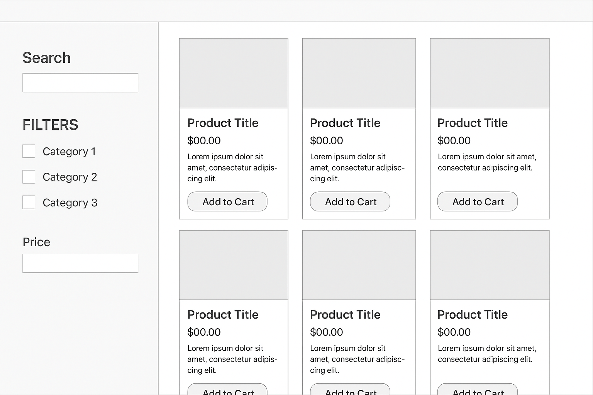
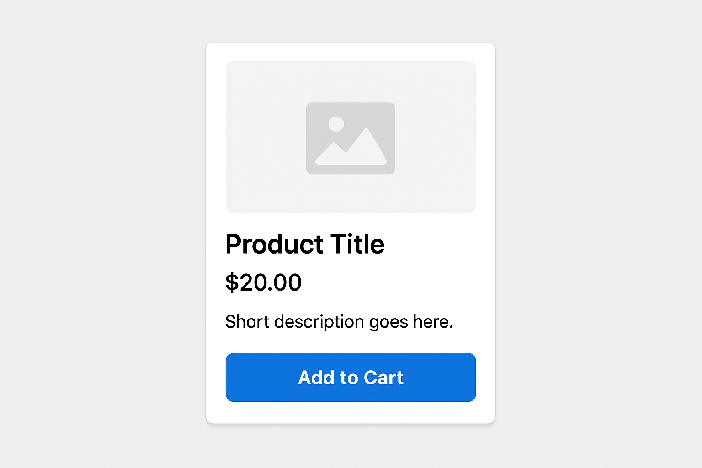
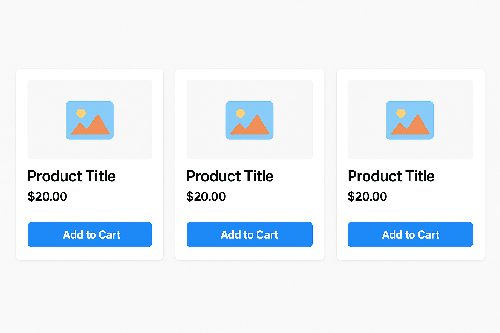
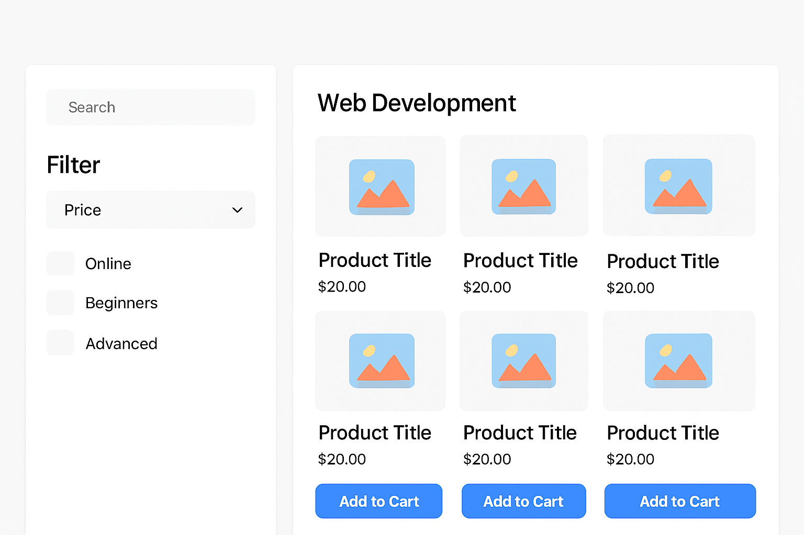

> **Flexbox** is a modern layout technique in CSS that allows you to create flexible and responsive layouts with ease. It enables the distribution of space within a container and aligns items along the main axis or cross axis.

Key Properties:
- `display: flex;`: Defines a flex container.
- `flex-direction`: Specifies the direction of the flex items (`row`, `column`).
- `justify-content`: Aligns items horizontally (main axis).
- `align-items`: Aligns items vertically (cross axis).
- `flex-wrap`: Allows wrapping of items when they exceed the container's width.

---

## Example (Basic Flexbox)

```html
<!DOCTYPE html>
<html lang="en">
<head>
    <meta charset="UTF-8">
    <meta name="viewport" content="width=device-width, initial-scale=1.0">
    <title>Flexbox Layout</title>
    <style>
        .container {
            display: flex;
            justify-content: space-between;
            align-items: center;
            height: 100vh;
            background-color: lightgray;
        }
        .box {
            width: 100px;
            height: 100px;
            background-color: steelblue;
            color: white;
            display: flex;
            justify-content: center;
            align-items: center;
        }
    </style>
</head>
<body>
    <div class="container">
        <div class="box">Box 1</div>
        <div class="box">Box 2</div>
        <div class="box">Box 3</div>
    </div>
</body>
</html>
```

---


Let’s extend this knowledge into building an **e-commerce portal layout**. We’ll do it step by step.

> **Wireframe Example:**
>
> 


## Step 1: Product Card using Flexbox
A single product card with image, title, description, and button.

```html
<!DOCTYPE html>
<html lang="en">
<head>
  <meta charset="UTF-8">
  <meta name="viewport" content="width=device-width, initial-scale=1.0">
  <title>Product Card</title>
  <style>
    .card {
      display: flex;
      flex-direction: column;
      width: 250px;
      border: 1px solid #ddd;
      border-radius: 8px;
      overflow: hidden;
      font-family: Arial, sans-serif;
    }
    .card img {
      width: 100%;
      height: auto;
    }
    .card-body {
      padding: 16px;
      display: flex;
      flex-direction: column;
      gap: 10px;
    }
    .card button {
      padding: 10px;
      background: steelblue;
      color: #fff;
      border: none;
      cursor: pointer;
    }
  </style>
</head>
<body>
  <div class="card">
    
    <div class="card-body">
      <h3>Product Title</h3>
      <p>Short description of the product.</p>
      <button>Add to Cart</button>
    </div>
  </div>
</body>
</html>
```

> **Example outcome:**
>
> 

> **Tip:** For a more realistic outcome, use a relevant image like `card.png` (place it in your project folder and update the `src` attribute). This helps you visualize how your card will look with your own assets.


---

## Step 2: Multiple Cards in a Row
Now we arrange multiple product cards side by side using **flexbox**.

```html
<!DOCTYPE html>
<html lang="en">
<head>
  <meta charset="UTF-8">
  <meta name="viewport" content="width=device-width, initial-scale=1.0">
  <title>Product Grid</title>
  <style>
    .product-grid {
      display: flex;
      flex-wrap: wrap;
      gap: 20px;
    }
    .card {
      display: flex;
      flex-direction: column;
      width: 250px;
      border: 1px solid #ddd;
      border-radius: 8px;
      overflow: hidden;
    }
    .card img {
      width: 100%;
      height: auto;
    }
    .card-body {
      padding: 16px;
      display: flex;
      flex-direction: column;
      gap: 10px;
    }
    .card button {
      padding: 10px;
      background: steelblue;
      color: #fff;
      border: none;
      cursor: pointer;
    }
  </style>
</head>
<body>
  <div class="product-grid">
    <div class="card">
      
      <div class="card-body">
        <h3>Product 1</h3>
        <p>Description</p>
        <button>Add to Cart</button>
      </div>
    </div>
    <div class="card">
      
      <div class="card-body">
        <h3>Product 2</h3>
        <p>Description</p>
        <button>Add to Cart</button>
      </div>
    </div>
    <div class="card">
      
      <div class="card-body">
        <h3>Product 3</h3>
        <p>Description</p>
        <button>Add to Cart</button>
      </div>
    </div>
  </div>
</body>
</html>
```

> **Product Grid Example:**
>
> 

---

## Step 3: Adding a Sidebar for Search and Filters
Now let’s complete the layout with a sidebar on the left and the product grid on the right.

```html
<!DOCTYPE html>
<html lang="en">
<head>
  <meta charset="UTF-8">
  <meta name="viewport" content="width=device-width, initial-scale=1.0">
  <title>E-commerce Layout</title>
  <style>
    .layout {
      display: flex;
      height: 100vh;
      font-family: Arial, sans-serif;
    }
    .sidebar {
      width: 20%;
      background: #f4f4f4;
      padding: 20px;
    }
    .content {
      width: 80%;
      padding: 20px;
      display: flex;
      flex-wrap: wrap;
      gap: 20px;
    }
    .card {
      display: flex;
      flex-direction: column;
      width: 200px;
      border: 1px solid #ddd;
      border-radius: 8px;
      overflow: hidden;
    }
    .card img {
      width: 100%;
      height: auto;
    }
    .card-body {
      padding: 16px;
      display: flex;
      flex-direction: column;
      gap: 10px;
    }
    .card button {
      padding: 10px;
      background: steelblue;
      color: #fff;
      border: none;
      cursor: pointer;
    }
  </style>
</head>
<body>
  <div class="layout">
    <aside class="sidebar">
      <h2>Search & Filters</h2>
      <input type="text" placeholder="Search..." style="width:100%;padding:8px;">
      <h3>Categories</h3>
      <ul>
        <li>Web Dev</li>
        <li>Design</li>
        <li>Data Science</li>
      </ul>
    </aside>
    <main class="content">
      <div class="card">
        
        <div class="card-body">
          <h3>Course 1</h3>
          <p>Intro to HTML</p>
          <button>Add to Cart</button>
        </div>
      </div>
      <div class="card">
        
        <div class="card-body">
          <h3>Course 2</h3>
          <p>Learn CSS</p>
          <button>Add to Cart</button>
        </div>
      </div>
      <div class="card">
        
        <div class="card-body">
          <h3>Course 3</h3>
          <p>Master Flexbox</p>
          <button>Add to Cart</button>
        </div>
      </div>
    </main>
  </div>
</body>
</html>
```

> **Final Layout Example:**
>
> 